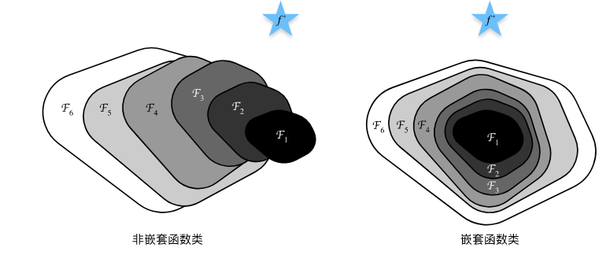

# 参考资料

* [《动手学深度学习》 — 动手学深度学习 2.0.0-beta0 documentation (d2l.ai)](https://zh.d2l.ai/)

# 预备知识

# 线性神经网络

## softmax运算

softmax函数将未规范化的预测变换为非负并且总和为1，同时要求模型保持可导。

$$
\hat{\mathbf{y}} = \mathrm{softmax}(\mathbf{o})\quad \text{其中}\quad \hat{y}_j = \frac{\exp(o_j)}{\sum_k \exp(o_k)}
$$

# 多层感知机（MLP）

# 深度学习计算

## 层和块

## 参数管理

### 参数访问


```python
net[2].state_dict() #访问参数
net.state_dict()

#分别返回
OrderedDict([('weight', tensor([[ 0.3231, -0.3373,  0.1639, -0.3125,  0.0527, -0.2957,  0.0192,  0.0039]])), ('bias', tensor([-0.2930]))])
OrderedDict([('0.weight', torch.Size([8, 4])), ('0.bias', torch.Size([8])), ('2.weight', torch.Size([1, 8])), ('2.bias', torch.Size([1]))])
```

### 参数初始化

内置初始化

```python
def init_normal(m):
    if type(m) == nn.Linear:
        nn.init.normal_(m.weight, mean=0, std=0.01)
        nn.init.zeros_(m.bias)
	#或者
	nn.init.constant_(m.weight, 1)
        nn.init.zeros_(m.bias)
net.apply(init_normal)
```

### 参数绑定

如果两个层引用的本质上是一个层，那么它们的参数始终相同

```python
shared = nn.Linear(8, 8)
net = nn.Sequential(nn.Linear(4, 8), nn.ReLU(),
                    shared, nn.ReLU(),
                    shared, nn.ReLU(),
                    nn.Linear(8, 1))
```

### 延后初始化

只有在得到第一个样本输入的时候第一个权重矩阵的大小才能确定，因此需要在那之后再初始化

```python
net = nn.Sequential(nn.LazyLinear(256), nn.ReLU(),nn.Linear(256,10))
print(net)
[net[i].state_dict() for i in range(len(net))]
X = torch.zeros([2,20],dtype=torch.float32).uniform_(0, 10)
net(X)
print(net)
```

## 自定义层

## 读写文件

保存和读取模型

```python
class MLP(nn.Module):
    def __init__(self):
        super().__init__()
        self.hidden = nn.Linear(20, 256)
        self.output = nn.Linear(256, 10)

    def forward(self, x):
        return self.output(F.relu(self.hidden(x)))
net = MLP()

#保存
torch.save(net.state_dict(), 'mlp.params')

#读取
clone = MLP()
clone.load_state_dict(torch.load('mlp.params'))
clone.eval() #不再改变模型参数
```

## GPU

```python
def try_gpu(i=0):  #@save
    """如果存在，则返回gpu(i)，否则返回cpu()"""
    if torch.cuda.device_count() >= i + 1:
        return torch.device(f'cuda:{i}')
    return torch.device('cpu')

def try_all_gpus():  #@save
    """返回所有可用的GPU，如果没有GPU，则返回[cpu(),]"""
    devices = [torch.device(f'cuda:{i}')
             for i in range(torch.cuda.device_count())]
    return devices if devices else [torch.device('cpu')]

X = torch.ones(2, 3, device=try_gpu(0))
Z = X.cuda(1) #转到cuda:1

net = nn.Sequential(nn.Linear(3, 1)) #默认在CPU
net = net.to(device=try_gpu())
```

多个数据只有在同一个设备（CPU或者同一个GPU）上才能一起操作（比如求和）。

人们使用GPU来进行机器学习，因为单个GPU相对运行速度快。 但是在设备（CPU、GPU和其他机器）之间传输数据比计算慢得多。

# 卷积神经网络（CNN）

## 从全连接层到卷积

### 引入

当输入维度极大（如百万级像素的图片），则MLP的成本极高。考虑到图片的一些特性，一个合于计算机视觉的神经网络架构应该具有：

1. 平移不变性：不管检测对象出现在图像中的哪个位置，神经网络的前面几层应该对相同的图像区域具有相似的反应
2. 局部性：神经网络的前面几层应该只探索输入图像中的局部区域，而不过度在意图像中相隔较远区域的关系

对于一个二维图片$\mathbf{X}$，其隐藏表示$\mathbf{H}$在数学上应该是一个矩阵。考虑到这是二维映射到二维，权重矩阵应变为四阶的权重张量。

$$
\begin{split}\begin{aligned} \left[\mathbf{H}\right]_{i, j} &= [\mathbf{U}]_{i, j} + \sum_k \sum_l[\mathsf{W}]_{i, j, k, l}  [\mathbf{X}]_{k, l}\\ &=  [\mathbf{U}]_{i, j} +
\sum_a \sum_b [\mathsf{V}]_{i, j, a, b}  [\mathbf{X}]_{i+a, j+b}.\end{aligned}\end{split}
$$

其中，从$\mathsf{W}$到$\mathsf{V}$的转换只是形式上的转换，因为在这两个四阶张量的元素之间存在一一对应的关系。$[\mathsf{V}]_{i, j, a, b} = [\mathsf{W}]_{i, j, i+a, j+b}$

应用平移不变性，$\mathsf{V}$和$\mathbf{U}$不应依赖于$(i,j)$的值，因此可以简化上式为

$$
[\mathbf{H}]_{i, j} = u + \sum_a\sum_b [\mathbf{V}]_{a, b} [\mathbf{X}]_{i+a, j+b}.
$$

这样$\mathsf{V}$是二维的，$u$是一维的，参数数量大幅减少。

应用局部性，在离中心$(i,j)$的地方，$\mathsf{V}$的权重应该为零，因此进一步简化

$$
[\mathbf{H}]_{i, j} = u + \sum_{a = -\Delta}^{\Delta} \sum_{b = -\Delta}^{\Delta} [\mathbf{V}]_{a, b}  [\mathbf{X}]_{i+a, j+b}.
$$

$\mathsf{V}$被称为卷积核或者滤波器（filter）

### 卷积

数学上的卷积被定义为

$$
(f * g)(\mathbf{x}) = \int f(\mathbf{z}) g(\mathbf{x}-\mathbf{z}) d\mathbf{z}.
$$

对于二维张量

$$
(f * g)(i, j) = \sum_a\sum_b f(a, b) g(i-a, j-b).
$$

因此称为“卷积神经网络”

### 通道

实际上，图像不是二维张量，而是一个由高度、宽度和颜色组成的三维张量。

此外，由于输入图像是三维的，我们的隐藏表示$\mathbf{H}$也最好采用三维张量。我们可以把隐藏表示想象为一系列具有“通道”的二维张量。这些通道有时也被称为特征映射。

$$
[\mathsf{H}]_{i,j,d} = \sum_{a = -\Delta}^{\Delta} \sum_{b = -\Delta}^{\Delta} \sum_c [\mathsf{V}]_{a, b, c, d} [\mathsf{X}]_{i+a, j+b, c},
$$

## 图像卷积

### 互相关运算  (cross-correlation)


一般而言，若不进行填充，则输出大小为$(n_h-k_h+1) \times (n_w-k_w+1).$

```python
class Conv2D(nn.Module):
    def __init__(self, kernel_size):
        super().__init__()
        self.weight = nn.Parameter(torch.rand(kernel_size))
        self.bias = nn.Parameter(torch.zeros(1))

    def forward(self, x):
        return corr2d(x, self.weight) + self.bias
```

### 互相关和卷积

严格来讲，互相关不等于卷积。但矩阵$\mathbf{K}$进行互相关运算和它经过水平+垂直翻转（对于方阵其实就是沿着副对角线翻折）后的结果$\mathbf{K}'$进行卷积的效果是相同的。所以在深度学习领域，我们一般将“相互关”运算称为“卷积”运算。

学习卷积核时，无论用严格卷积运算或互相关运算，卷积层的输出不会受太大影响。

### 特征映射和感受野

输出的卷积层有时被称为 *特征映射* （feature map）。

在卷积神经网络中，对于某一层的任意元素$x$，其 *感受野* （receptive field）是指在前向传播期间可能影响$x$计算的所有元素（来自所有先前层）。

当一个特征图中的任意元素需要检测更广区域的输入特征时，我们可以构建一个更深的网络。

## 填充和步幅

### 填充

为了保持输入输出大小不变，可以在输入的边缘填充零。$p_h=k_h-1$，$p_w=k_w-1$。尽可能保证两侧填充相近或一致（$\pm1$）。

### 步幅

一般默认每次滑动一个元素。 但是有时候为了高效计算或是缩减采样次数，卷积窗口可以跳过中间位置，每次滑动多个元素。

我们将每次滑动元素的数量称为 *步幅* （stride）。

输出形状为

$$
\lfloor(n_h-k_h+p_h+s_h)/s_h\rfloor \times \lfloor(n_w-k_w+p_w+s_w)/s_w\rfloor.
$$

若$p_h=k_h-1$，$p_w=k_w-1$，则可以简化为

$$
\lfloor(n_h+s_h-1)/s_h\rfloor \times \lfloor(n_w+s_w-1)/s_w\rfloor
$$

更进一步，如果可以整除

$$
(n_h/s_h) \times (n_w/s_w)
$$

## 多输入多输出通道

### 多输入通道

对于多输入通道，我们将与输入通道相同数量的卷积核组合成一个（形状是$c_i\times k_h\times k_w$）。每一个“子输入”与对应的“子卷积核”进行卷积运算后直接相加。


```python
import torch
from d2l import torch as d2l

def corr2d_multi_in(X, K):
    # 先遍历“X”和“K”的第0个维度（通道维度），再把它们加在一起
    return sum(d2l.corr2d(x, k) for x, k in zip(X, K))
```

### 多输出通道

对于多输入多输出通道，我们将与输出通道相同数量的多输入卷积核组合成一个（形状是$c_o\times c_i\times k_h\times k_w$）。每一个“子卷积核”与整个输入进行卷积运算之后作为对应的“子输出”。

```python
def corr2d_multi_in_out(X, K):
    # 迭代“K”的第0个维度，每次都对输入“X”执行互相关运算。
    # 最后将所有结果都叠加在一起
    return torch.stack([corr2d_multi_in(X, k) for k in K], 0)
```

### $1\times1$卷积层

看起来似乎没有多大意义。 毕竟，卷积的本质是有效提取相邻像素间的相关特征。但它常常用来调整网络层的通道数量和控制模型复杂性。


## 汇聚层

事实上，对于图片而言，整体移动一个像素的影响微乎其微，但卷积后的结果却可能发生很大变化。为了让卷积层对位置不再敏感，我们引入*汇聚层*（pooling）。

### 最大汇聚层和平均汇聚层

类似卷积核，汇聚窗口对窗口内的元素进行最大或者平均汇聚。


### 填充和步幅

类似卷积核，汇聚层也可以通过填充和步幅来调整输出的形状。

```python
X = torch.arange(16, dtype=torch.float32).reshape((1, 1, 4, 4))
X

pool2d = nn.MaxPool2d(3)
pool2d(X)

pool2d = nn.MaxPool2d((2, 3), stride=(2, 3), padding=(0, 1))
pool2d(X)
#stride指定步幅，padding指定填充
```

### 多个通道

在处理多通道输入数据时，汇聚层在每个输入通道上单独运算，而不是像卷积层一样在通道上对输入进行汇总。 这意味着汇聚层的输出通道数与输入通道数相同。

## 卷积神经网络（LeNet）

### 概览

LeNet发表于1998年，是最早发布的卷积神经网络之一，用于识别手写数字。LeNet这一名字来自其发明者杨立昆（Yann LeCun，法国人，图灵奖得主）。


```python
import torch
from torch import nn
from d2l import torch as d2l

net = nn.Sequential(
    nn.Conv2d(1, 6, kernel_size=5, padding=2), nn.Sigmoid(),
    nn.AvgPool2d(kernel_size=2, stride=2),
    nn.Conv2d(6, 16, kernel_size=5), nn.Sigmoid(),
    nn.AvgPool2d(kernel_size=2, stride=2),
    nn.Flatten(),
    nn.Linear(16 * 5 * 5, 120), nn.Sigmoid(),
    nn.Linear(120, 84), nn.Sigmoid(),
    nn.Linear(84, 10))
```

### 模型训练

```python
def evaluate_accuracy_gpu(net, data_iter, device=None): #@save
    """使用GPU计算模型在数据集上的精度"""
    if isinstance(net, nn.Module):
        net.eval()  # 设置为评估模式
        if not device:
            device = next(iter(net.parameters())).device
    # 正确预测的数量，总预测的数量
    metric = d2l.Accumulator(2)
    with torch.no_grad():
        for X, y in data_iter:
            if isinstance(X, list):
                # BERT微调所需的（之后将介绍）
                X = [x.to(device) for x in X]
            else:
                X = X.to(device)
            y = y.to(device)
            metric.add(d2l.accuracy(net(X), y), y.numel())
    return metric[0] / metric[1]
```

```python
def train_ch6(net, train_iter, test_iter, num_epochs, lr, device):
    """用GPU训练模型(在第六章定义)"""
    def init_weights(m):
        if type(m) == nn.Linear or type(m) == nn.Conv2d:
            nn.init.xavier_uniform_(m.weight)
    net.apply(init_weights)
    print('training on', device)
    net.to(device)
    optimizer = torch.optim.SGD(net.parameters(), lr=lr)
    loss = nn.CrossEntropyLoss()
    animator = d2l.Animator(xlabel='epoch', xlim=[1, num_epochs],
                            legend=['train loss', 'train acc', 'test acc'])
    timer, num_batches = d2l.Timer(), len(train_iter)
    for epoch in range(num_epochs):
        # 训练损失之和，训练准确率之和，样本数
        metric = d2l.Accumulator(3)
        net.train()
        for i, (X, y) in enumerate(train_iter):
            timer.start()
            optimizer.zero_grad()
            X, y = X.to(device), y.to(device)
            y_hat = net(X)
            l = loss(y_hat, y)
            l.backward()
            optimizer.step()
            with torch.no_grad():
                metric.add(l * X.shape[0], d2l.accuracy(y_hat, y), X.shape[0])
            timer.stop()
            train_l = metric[0] / metric[2]
            train_acc = metric[1] / metric[2]
            if (i + 1) % (num_batches // 5) == 0 or i == num_batches - 1:
                animator.add(epoch + (i + 1) / num_batches,
                             (train_l, train_acc, None))
        test_acc = evaluate_accuracy_gpu(net, test_iter)
        animator.add(epoch + 1, (None, None, test_acc))
    print(f'loss {train_l:.3f}, train acc {train_acc:.3f}, '
          f'test acc {test_acc:.3f}')
    print(f'{metric[2] * num_epochs / timer.sum():.1f} examples/sec '
          f'on {str(device)}')
```

### 小结

* 在卷积神经网络中，我们组合使用卷积层、非线性激活函数和汇聚层。
* 为了构造高性能的卷积神经网络，我们通常对卷积层进行排列，逐渐降低其表示的空间分辨率，同时增加通道数。
* 在传统的卷积神经网络中，卷积块编码得到的表征在输出之前需由一个或多个全连接层进行处理。（似乎一个全连接层效果也不会很差？）

# 现代卷积神经网络

## 深度卷积神经网络（AlexNet）

### 学习表征

在2012年前，图像特征都是机械地计算出来的。事实上，设计一套新的特征函数、改进结果，并撰写论文是盛极一时的潮流。

另一组研究人员想法则与众不同：他们认为特征本身应该被学习。比如在机器视觉中，最底层可能检测边缘、颜色和纹理。

随着时代的进步，数据和硬件的限制被极大地突破。

### AlexNet

由Alex Krizhevsky发表于2012年。与LeNet的对比如下：

<br />

```python
import torch
from torch import nn
from d2l import torch as d2l

net = nn.Sequential(
    # 这里，我们使用一个11*11的更大窗口来捕捉对象。
    # 同时，步幅为4，以减少输出的高度和宽度。
    # 另外，输出通道的数目远大于LeNet
    nn.Conv2d(1, 96, kernel_size=11, stride=4, padding=1), nn.ReLU(),
    nn.MaxPool2d(kernel_size=3, stride=2),
    # 减小卷积窗口，使用填充为2来使得输入与输出的高和宽一致，且增大输出通道数
    nn.Conv2d(96, 256, kernel_size=5, padding=2), nn.ReLU(),
    nn.MaxPool2d(kernel_size=3, stride=2),
    # 使用三个连续的卷积层和较小的卷积窗口。
    # 除了最后的卷积层，输出通道的数量进一步增加。
    # 在前两个卷积层之后，汇聚层不用于减少输入的高度和宽度
    nn.Conv2d(256, 384, kernel_size=3, padding=1), nn.ReLU(),
    nn.Conv2d(384, 384, kernel_size=3, padding=1), nn.ReLU(),
    nn.Conv2d(384, 256, kernel_size=3, padding=1), nn.ReLU(),
    nn.MaxPool2d(kernel_size=3, stride=2),
    nn.Flatten(),
    # 这里，全连接层的输出数量是LeNet中的好几倍。使用dropout层来减轻过拟合
    nn.Linear(6400, 4096), nn.ReLU(),
    nn.Dropout(p=0.5),
    nn.Linear(4096, 4096), nn.ReLU(),
    nn.Dropout(p=0.5),
    # 最后是输出层。由于这里使用Fashion-MNIST，所以用类别数为10，而非论文中的1000
    nn.Linear(4096, 10))
```

### 小结

* AlexNet的架构与LeNet相似，但使用了更多的卷积层和更多的参数来拟合大规模的ImageNet数据集。
* Dropout、ReLU和预处理是提升计算机视觉任务性能的其他关键步骤。

## 使用块的网络（VGG）

使用块的想法首先出现在牛津大学的视觉几何组（visualgeometry group）的VGG网络中。

### VGG块

```python
import torch
from torch import nn
from d2l import torch as d2l


def vgg_block(num_convs, in_channels, out_channels):
    layers = []
    for _ in range(num_convs):
        layers.append(nn.Conv2d(in_channels, out_channels,
                                kernel_size=3, padding=1))
        layers.append(nn.ReLU())
        in_channels = out_channels
    layers.append(nn.MaxPool2d(kernel_size=2,stride=2))
    return nn.Sequential(*layers)
```

### VGG网络


```python
def vgg(conv_arch):
    conv_blks = []
    in_channels = 1
    # 卷积层部分
    for (num_convs, out_channels) in conv_arch:
        conv_blks.append(vgg_block(num_convs, in_channels, out_channels))
        in_channels = out_channels

    return nn.Sequential(
        *conv_blks, nn.Flatten(),
        # 全连接层部分
        nn.Linear(out_channels * 7 * 7, 4096), nn.ReLU(), nn.Dropout(0.5),
        nn.Linear(4096, 4096), nn.ReLU(), nn.Dropout(0.5),
        nn.Linear(4096, 10))

conv_arch = ((1, 64), (1, 128), (2, 256), (2, 512), (2, 512))
net = vgg(conv_arch)
```

## 网络中的网络（NiN）

全连接层的使用，可能会完全放弃表征的空间结构。*网络中的网络* （ *NiN* ）提供了一个非常简单的解决方案：在每个像素的通道上分别使用多层感知机。

### NiN块

在每个像素的通道上分别使用多层感知机，可以视为使用$1\times1$的卷积层。从另一个角度看，即将空间维度中的每个像素视为单个样本，将通道维度视为不同特征（feature）。


```python
import torch
from torch import nn
from d2l import torch as d2l


def nin_block(in_channels, out_channels, kernel_size, strides, padding):
    return nn.Sequential(
        nn.Conv2d(in_channels, out_channels, kernel_size, strides, padding),
        nn.ReLU(),
        nn.Conv2d(out_channels, out_channels, kernel_size=1), nn.ReLU(),
        nn.Conv2d(out_channels, out_channels, kernel_size=1), nn.ReLU())
```

### NiN模型

NiN完全取消了全连接层。 相反，NiN使用一个NiN块，其输出通道数等于标签类别的数量。最后放一个 *全局平均汇聚层* （global average pooling layer），生成一个对数几率 （logits）。

移除全连接层可减少过拟合，同时显著减少NiN的参数。

```python
net = nn.Sequential(
    nin_block(1, 96, kernel_size=11, strides=4, padding=0),
    nn.MaxPool2d(3, stride=2),
    nin_block(96, 256, kernel_size=5, strides=1, padding=2),
    nn.MaxPool2d(3, stride=2),
    nin_block(256, 384, kernel_size=3, strides=1, padding=1),
    nn.MaxPool2d(3, stride=2),
    nn.Dropout(0.5),
    # 标签类别数是10
    nin_block(384, 10, kernel_size=3, strides=1, padding=1),
    nn.AdaptiveAvgPool2d((1, 1)),
    # 将四维的输出转成二维的输出，其形状为(批量大小,10)
    nn.Flatten())
```

## 含并行连结的网络（GoogLeNet）

### Inception块

在GoogLeNet中，基本的卷积块被称为Inception块（Inception block）。这很可能得名于电影《盗梦空间》（Inception）。


Inception块由四条并行路径组成，可以从不同空间大小中提取信息。$1\times 1$卷积层的使用可以减少通道数，从而降低模型复杂性。

这四条路径都使用合适的填充来使输入与输出的高和宽一致，最后我们将每条线路的输出**在通道维度上连结**，并构成Inception块的输出。

在Inception块中，通常调整的超参数是每层输出通道数。

```python
import torch
from torch import nn
from torch.nn import functional as F
from d2l import torch as d2l


class Inception(nn.Module):
    # c1--c4是每条路径的输出通道数
    def __init__(self, in_channels, c1, c2, c3, c4, **kwargs):
        super(Inception, self).__init__(**kwargs)
        # 线路1，单1x1卷积层
        self.p1_1 = nn.Conv2d(in_channels, c1, kernel_size=1)
        # 线路2，1x1卷积层后接3x3卷积层
        self.p2_1 = nn.Conv2d(in_channels, c2[0], kernel_size=1)
        self.p2_2 = nn.Conv2d(c2[0], c2[1], kernel_size=3, padding=1)
        # 线路3，1x1卷积层后接5x5卷积层
        self.p3_1 = nn.Conv2d(in_channels, c3[0], kernel_size=1)
        self.p3_2 = nn.Conv2d(c3[0], c3[1], kernel_size=5, padding=2)
        # 线路4，3x3最大汇聚层后接1x1卷积层
        self.p4_1 = nn.MaxPool2d(kernel_size=3, stride=1, padding=1)
        self.p4_2 = nn.Conv2d(in_channels, c4, kernel_size=1)

    def forward(self, x):
        p1 = F.relu(self.p1_1(x))
        p2 = F.relu(self.p2_2(F.relu(self.p2_1(x))))
        p3 = F.relu(self.p3_2(F.relu(self.p3_1(x))))
        p4 = F.relu(self.p4_2(self.p4_1(x)))
        # 在通道维度上连结输出
        return torch.cat((p1, p2, p3, p4), dim=1)
```

那么为什么GoogLeNet这个网络如此有效呢？因为不同大小的滤波器可以有效地识别不同范围的图像细节。

### GoogLeNet模型


```python
b1 = nn.Sequential(nn.Conv2d(1, 64, kernel_size=7, stride=2, padding=3),
                   nn.ReLU(),
                   nn.MaxPool2d(kernel_size=3, stride=2, padding=1))

b2 = nn.Sequential(nn.Conv2d(64, 64, kernel_size=1),
                   nn.ReLU(),
                   nn.Conv2d(64, 192, kernel_size=3, padding=1),
                   nn.ReLU(),
                   nn.MaxPool2d(kernel_size=3, stride=2, padding=1))

b3 = nn.Sequential(Inception(192, 64, (96, 128), (16, 32), 32),
                   Inception(256, 128, (128, 192), (32, 96), 64),
                   nn.MaxPool2d(kernel_size=3, stride=2, padding=1))

b4 = nn.Sequential(Inception(480, 192, (96, 208), (16, 48), 64),
                   Inception(512, 160, (112, 224), (24, 64), 64),
                   Inception(512, 128, (128, 256), (24, 64), 64),
                   Inception(512, 112, (144, 288), (32, 64), 64),
                   Inception(528, 256, (160, 320), (32, 128), 128),
                   nn.MaxPool2d(kernel_size=3, stride=2, padding=1))

b5 = nn.Sequential(Inception(832, 256, (160, 320), (32, 128), 128),
                   Inception(832, 384, (192, 384), (48, 128), 128),
                   nn.AdaptiveAvgPool2d((1,1)),
                   nn.Flatten())

net = nn.Sequential(b1, b2, b3, b4, b5, nn.Linear(1024, 10))
```

Inception块的通道数分配之比是在ImageNet数据集上通过大量的实验得来的。

## 批量规范化

批量规范化是一种流行且有效的技术，可持续加速深层网络的收敛速度。

### 训练深层网络

训练神经网络时的一些挑战

1. 数据预处理的方式通常会对最终结果产生巨大影响。
2. 对于典型的MLP或CNN。当我们训练时，中间层中的变量（例如，MLP中的仿射变换输出）可能具有更广的变化范围。
3. 第三，更深层的网络很复杂，容易过拟合。

对此，我们可以在每次训练迭代中，首先**规范化输入**，即通过减去其均值并除以其标准差，其中两者均基于当前处理的小批量。 接下来，我们应用比例系数和比例偏移。

对于一个小批量$\mathcal{B}$，其中的一个数据$\mathbf{x} \in \mathcal{B}$，批量规范化$\mathrm{BN}$定义如下：

$$
\mathrm{BN}(\mathbf{x}) = \boldsymbol{\gamma} \odot \frac{\mathbf{x} - \hat{\boldsymbol{\mu}}_\mathcal{B}}{\hat{\boldsymbol{\sigma}}_\mathcal{B}} + \boldsymbol{\beta}.
$$

$$
\begin{split}\begin{aligned} \hat{\boldsymbol{\mu}}_\mathcal{B} &= \frac{1}{|\mathcal{B}|} \sum_{\mathbf{x} \in \mathcal{B}} \mathbf{x},\\
\hat{\boldsymbol{\sigma}}_\mathcal{B}^2 &= \frac{1}{|\mathcal{B}|} \sum_{\mathbf{x} \in \mathcal{B}} (\mathbf{x} - \hat{\boldsymbol{\mu}}_{\mathcal{B}})^2 + \epsilon.\end{aligned}\end{split}
$$

其中$\epsilon > 0$是为了排除除以零的情况。

另外，在训练过程中，我们无法得知使用整个数据集来估计平均值和方差，所以只能根据每个小批次的平均值和方差不断训练模型。 而在预测模式下，可以根据整个数据集精确计算批量规范化所需的平均值和方差。

### 批量规范化层

对于全连接层：

$$
\mathbf{h} = \phi(\mathrm{BN}(\mathbf{W}\mathbf{x} + \mathbf{b}) ).
$$

对于卷积层：

每个通道都有自己的拉伸（scale）和偏移（shift）参数，这两个参数都是标量。 假设我们的小批量包含$m$个样本，并且对于每个通道，卷积的输出具有高度$p$和宽度$q$。 那么对于卷积层，我们在每个输出通道的$m\cdot p\cdot q$个元素上同时执行每个批量规范化。

```python
import torch
from torch import nn
from d2l import torch as d2l

#从零实现
def batch_norm(X, gamma, beta, moving_mean, moving_var, eps, momentum):
    # 通过is_grad_enabled来判断当前模式是训练模式还是预测模式
    if not torch.is_grad_enabled():
        # 如果是在预测模式下，直接使用传入的移动平均所得的均值和方差
        X_hat = (X - moving_mean) / torch.sqrt(moving_var + eps)
    else:
        assert len(X.shape) in (2, 4)
        if len(X.shape) == 2:
            # 使用全连接层的情况，计算特征维上的均值和方差
            mean = X.mean(dim=0)
            var = ((X - mean) ** 2).mean(dim=0)
        else:
            # 使用二维卷积层的情况，计算通道维上（axis=1）的均值和方差。
            # 这里我们需要保持X的形状以便后面可以做广播运算
            mean = X.mean(dim=(0, 2, 3), keepdim=True)
            var = ((X - mean) ** 2).mean(dim=(0, 2, 3), keepdim=True)
        # 训练模式下，用当前的均值和方差做标准化
        X_hat = (X - mean) / torch.sqrt(var + eps)
        # 更新移动平均的均值和方差
        moving_mean = momentum * moving_mean + (1.0 - momentum) * mean
        moving_var = momentum * moving_var + (1.0 - momentum) * var
    Y = gamma * X_hat + beta  # 缩放和移位
    return Y, moving_mean.data, moving_var.data

class BatchNorm(nn.Module):
    # num_features：完全连接层的输出数量或卷积层的输出通道数。
    # num_dims：2表示完全连接层，4表示卷积层
    def __init__(self, num_features, num_dims):
        super().__init__()
        if num_dims == 2:
            shape = (1, num_features)
        else:
            shape = (1, num_features, 1, 1)
        # 参与求梯度和迭代的拉伸和偏移参数，分别初始化成1和0
        self.gamma = nn.Parameter(torch.ones(shape))
        self.beta = nn.Parameter(torch.zeros(shape))
        # 非模型参数的变量初始化为0和1
        self.moving_mean = torch.zeros(shape)
        self.moving_var = torch.ones(shape)

    def forward(self, X):
        # 如果X不在内存上，将moving_mean和moving_var
        # 复制到X所在显存上
        if self.moving_mean.device != X.device:
            self.moving_mean = self.moving_mean.to(X.device)
            self.moving_var = self.moving_var.to(X.device)
        # 保存更新过的moving_mean和moving_var
        Y, self.moving_mean, self.moving_var = batch_norm(
            X, self.gamma, self.beta, self.moving_mean,
            self.moving_var, eps=1e-5, momentum=0.9)
        return Y

net = nn.Sequential(
    nn.Conv2d(1, 6, kernel_size=5), BatchNorm(6, num_dims=4), nn.Sigmoid(),
    nn.AvgPool2d(kernel_size=2, stride=2),
    nn.Conv2d(6, 16, kernel_size=5), BatchNorm(16, num_dims=4), nn.Sigmoid(),
    nn.AvgPool2d(kernel_size=2, stride=2), nn.Flatten(),
    nn.Linear(16*4*4, 120), BatchNorm(120, num_dims=2), nn.Sigmoid(),
    nn.Linear(120, 84), BatchNorm(84, num_dims=2), nn.Sigmoid(),
    nn.Linear(84, 10))

#调用框架实现
net = nn.Sequential(
    nn.Conv2d(1, 6, kernel_size=5), nn.BatchNorm2d(6), nn.Sigmoid(),
    nn.AvgPool2d(kernel_size=2, stride=2),
    nn.Conv2d(6, 16, kernel_size=5), nn.BatchNorm2d(16), nn.Sigmoid(),
    nn.AvgPool2d(kernel_size=2, stride=2), nn.Flatten(),
    nn.Linear(256, 120), nn.BatchNorm1d(120), nn.Sigmoid(),
    nn.Linear(120, 84), nn.BatchNorm1d(84), nn.Sigmoid(),
    nn.Linear(84, 10))
```

### 争议

直观地说，批量规范化被认为可以使优化更加平滑，然而我们目前找不到严谨科学的解释。

原作者提出的“减少内部协变量偏移”的原始动机似乎不是一个有效的解释。

深度学习就像“炼金术”，很多东西（比如MLP、CNN、批量规范化）十分有效，但我们不知道为什么这么有效。

## 残差网络（ResNet）

### 函数类

我们希望在神经网络架构$\mathcal{F}$中找到最接近真实函数$f$的函数$f^*_\mathcal{F}$  

$$
f^*_\mathcal{F} := \mathop{\mathrm{argmin}}_f L(\mathbf{X}, \mathbf{y}, f) \text{ subject to } f \in \mathcal{F}.
$$

为了使得$f^*_\mathcal{F}$更接近$f$，我们可以设计更强大的架构$\mathcal{F}'$。然而，如果$\mathcal{F} \not\subseteq \mathcal{F}'$  
，则无法保证新的体系“更近似”。因此，我们希望$\mathcal{F}_1 \subseteq \ldots \subseteq \mathcal{F}_n$使得$f^*_\mathcal{F}$必然一步步向$f$靠拢。



对于深度神经网络，如果我们能将新添加的层训练成 *恒等映射* （identity function）$f(\mathbf{x}) = \mathbf{x}$，新模型和原模型将同样有效。 同时，由于新模型可能得出更优的解来拟合训练数据集，因此添加层似乎更容易降低训练误差。

针对这一问题，何恺明等人提出了 *残差网络* （ResNet），它在2015年的ImageNet图像识别挑战赛夺魁，并深刻影响了后来的深度神经网络的设计。

### 残差块

相比于直接拟合出映射$f(\mathbf{x})$，拟合出残差映射$f(\mathbf{x}) - \mathbf{x}$更容易拟合出恒等映射，因为可以直接将权重和偏置设为零。下图是一个正常块（左图）和一个残差块（右图）。


```python
import torch
from torch import nn
from torch.nn import functional as F
from d2l import torch as d2l


class Residual(nn.Module):  #@save
    def __init__(self, input_channels, num_channels,
                 use_1x1conv=False, strides=1):
        super().__init__()
        self.conv1 = nn.Conv2d(input_channels, num_channels,
                               kernel_size=3, padding=1, stride=strides)
        self.conv2 = nn.Conv2d(num_channels, num_channels,
                               kernel_size=3, padding=1)
        if use_1x1conv:
            self.conv3 = nn.Conv2d(input_channels, num_channels,
                                   kernel_size=1, stride=strides)
        else:
            self.conv3 = None
        self.bn1 = nn.BatchNorm2d(num_channels)
        self.bn2 = nn.BatchNorm2d(num_channels)

    def forward(self, X):
        Y = F.relu(self.bn1(self.conv1(X)))
        Y = self.bn2(self.conv2(Y))
        if self.conv3:
            X = self.conv3(X)
        Y += X
        return F.relu(Y)
```

此代码生成两种类型的网络： 一种是当`use_1x1conv=False`时，应用ReLU非线性函数之前，将输入添加到输出。 另一种是当`use_1x1conv=True`时，添加通过$1\times1$卷积调整通道和分辨率。


### ResNet模型


```python
b1 = nn.Sequential(nn.Conv2d(1, 64, kernel_size=7, stride=2, padding=3),
                   nn.BatchNorm2d(64), nn.ReLU(),
                   nn.MaxPool2d(kernel_size=3, stride=2, padding=1))

def resnet_block(input_channels, num_channels, num_residuals,
                 first_block=False):
    blk = []
    for i in range(num_residuals):
        if i == 0 and not first_block:
            blk.append(Residual(input_channels, num_channels,
                                use_1x1conv=True, strides=2))
        else:
            blk.append(Residual(num_channels, num_channels))
    return blk

b2 = nn.Sequential(*resnet_block(64, 64, 2, first_block=True))
b3 = nn.Sequential(*resnet_block(64, 128, 2))
b4 = nn.Sequential(*resnet_block(128, 256, 2))
b5 = nn.Sequential(*resnet_block(256, 512, 2))

net = nn.Sequential(b1, b2, b3, b4, b5,
                    nn.AdaptiveAvgPool2d((1,1)),
                    nn.Flatten(), nn.Linear(512, 10))
```

在之前所有架构中，分辨率降低，通道数量增加，直到全局平均汇聚层聚集所有特征。

## 稠密连接网络（DenseNet）

*稠密连接网络* （DenseNet）在某种程度上是ResNet的逻辑扩展。

### 从ResNet到DenseNet

考虑泰勒展开，在$x$趋近于零时，

$$
f(x) = f(0) + f'(0) x + \frac{f''(0)}{2!}  x^2 + \frac{f'''(0)}{3!}  x^3 + \ldots.
$$

同样，ResNet将函数展开为

$$
f(\mathbf{x}) = \mathbf{x} + g(\mathbf{x}).
$$

那么再向前拓展一步，如果我们想将$f$拓展成超过两部分的信息呢？


ResNet和DenseNet的关键区别在于，DenseNet输出是 *连接* （用图中的$[,]$表示）而不是如ResNet的简单相加。

$$
\mathbf{x} \to \left[
\mathbf{x},
f_1(\mathbf{x}),
f_2([\mathbf{x}, f_1(\mathbf{x})]), f_3([\mathbf{x}, f_1(\mathbf{x}), f_2([\mathbf{x}, f_1(\mathbf{x})])]), \ldots\right].
$$


稠密网络主要由2部分构成： *稠密块* （dense block）和 *过渡层* （transition layer）。 前者定义如何连接输入和输出，而后者则控制通道数量，使其不会太复杂。

### 稠密块体

一个*稠密块*由多个卷积块组成，每个卷积块使用相同数量的输出通道。 然而，在前向传播中，我们将每个卷积块的输入和输出在通道维上连结。

卷积块的通道数控制了输出通道数相对于输入通道数的增长，因此也被称为 *增长率* （growth rate）。

$$
稠密快输出通道数=稠密快输入通道数+卷积块数量\times增长率
$$

```python
import torch
from torch import nn
from d2l import torch as d2l


def conv_block(input_channels, num_channels):
    return nn.Sequential(
        nn.BatchNorm2d(input_channels), nn.ReLU(),
        nn.Conv2d(input_channels, num_channels, kernel_size=3, padding=1))

class DenseBlock(nn.Module):
    def __init__(self, num_convs, input_channels, num_channels):
        super(DenseBlock, self).__init__()
        layer = []
        for i in range(num_convs):
            layer.append(conv_block(
                num_channels * i + input_channels, num_channels))
        self.net = nn.Sequential(*layer)

    def forward(self, X):
        for blk in self.net:
            Y = blk(X)
            # 连接通道维度上每个块的输入和输出
            X = torch.cat((X, Y), dim=1)
        return X
```

### 过渡层

过渡层通过$1\times1$卷积层来减小通道数，并使用步幅为2的平均汇聚层减半高和宽，从而进一步降低模型复杂度。

```python
def transition_block(input_channels, num_channels):
    return nn.Sequential(
        nn.BatchNorm2d(input_channels), nn.ReLU(),
        nn.Conv2d(input_channels, num_channels, kernel_size=1),
        nn.AvgPool2d(kernel_size=2, stride=2))
```

### DenseNet模型

```python
b1 = nn.Sequential(
    nn.Conv2d(1, 64, kernel_size=7, stride=2, padding=3),
    nn.BatchNorm2d(64), nn.ReLU(),
    nn.MaxPool2d(kernel_size=3, stride=2, padding=1))

# num_channels为当前的通道数
num_channels, growth_rate = 64, 32
num_convs_in_dense_blocks = [4, 4, 4, 4]
blks = []
for i, num_convs in enumerate(num_convs_in_dense_blocks):
    blks.append(DenseBlock(num_convs, num_channels, growth_rate))
    # 上一个稠密块的输出通道数
    num_channels += num_convs * growth_rate
    # 在稠密块之间添加一个转换层，使通道数量减半
    if i != len(num_convs_in_dense_blocks) - 1:
        blks.append(transition_block(num_channels, num_channels // 2))
        num_channels = num_channels // 2

net = nn.Sequential(
    b1, *blks,
    nn.BatchNorm2d(num_channels), nn.ReLU(),
    nn.AdaptiveAvgPool2d((1, 1)),
    nn.Flatten(),
    nn.Linear(num_channels, 10))
```

# 循环神经网络（RNN）

## 序列模型


$$
x_t \sim P(x_t \mid x_{t-1}, \ldots, x_1).
$$

### 自回归模型

考虑到输入$x_{t−1},…,x_1$本身因$t$而异，无法训练，我们需要一个近似方法来使这个计算变得容易处理。

策略一：使用观测序列$x_{t-1}, \ldots, x_{t-\tau}$，舍弃掉过于之前的数据

策略二：*隐变量自回归模型* （latent autoregressive models），即保留一些对过去观测的总结$h_t$， 并且同时更新预测$\hat{x}_t$和总结$h_t$。


这两种情况都有一个显而易见的问题：如何生成训练数据？ 一个经典方法是使用历史观测来预测下一个未来观测。我们假设序列的动力学是不变的。

$$
P(x_1, \ldots, x_T) = \prod_{t=1}^T P(x_t \mid x_{t-1}, \ldots, x_1).
$$

### 马尔可夫模型

若上述的策略一是精确的，也就是说$x_t$确实只由$x_{t-\tau}, ..., x_{t-1}$决定，那么我们就说序列满足*马尔可夫条件* （Markov condition）。特别是，如果$\tau=1$，我们就得到一个*一阶马尔可夫模型* （first-order Markov model）。

$$
P(x_1, \ldots, x_T) = \prod_{t=1}^T P(x_t \mid x_{t-1}) \text{ 当 } P(x_1 \mid x_0) = P(x_1).
$$

使用动态规划可以沿着马尔可夫链精确地计算结果。

$$
\begin{split}\begin{aligned}
P(x_{t+1} \mid x_{t-1})
&= \frac{\sum_{x_t} P(x_{t+1}, x_t, x_{t-1})}{P(x_{t-1})}\\
&= \frac{\sum_{x_t} P(x_{t+1} \mid x_t, x_{t-1}) P(x_t, x_{t-1})}{P(x_{t-1})}\\
&= \sum_{x_t} P(x_{t+1} \mid x_t) P(x_t \mid x_{t-1})
\end{aligned}\end{split}
$$

### 训练

```python
%matplotlib inline
import torch
from torch import nn
from d2l import torch as d2l

T = 1000  # 总共产生1000个点
time = torch.arange(1, T + 1, dtype=torch.float32)
x = torch.sin(0.01 * time) + torch.normal(0, 0.2, (T,))
d2l.plot(time, [x], 'time', 'x', xlim=[1, 1000], figsize=(6, 3))

tau = 4
features = torch.zeros((T - tau, tau))
for i in range(tau):
    features[:, i] = x[i: T - tau + i]
labels = x[tau:].reshape((-1, 1))

batch_size, n_train = 16, 600
# 只有前n_train个样本用于训练
train_iter = d2l.load_array((features[:n_train], labels[:n_train]),
                            batch_size, is_train=True)

# 初始化网络权重的函数
def init_weights(m):
    if type(m) == nn.Linear:
        nn.init.xavier_uniform_(m.weight)

# 一个简单的多层感知机
def get_net():
    net = nn.Sequential(nn.Linear(4, 10),
                        nn.ReLU(),
                        nn.Linear(10, 1))
    net.apply(init_weights)
    return net

# 平方损失。注意：MSELoss计算平方误差时不带系数1/2
loss = nn.MSELoss(reduction='none')

def train(net, train_iter, loss, epochs, lr):
    trainer = torch.optim.Adam(net.parameters(), lr)
    for epoch in range(epochs):
        for X, y in train_iter:
            trainer.zero_grad()
            l = loss(net(X), y)
            l.sum().backward()
            trainer.step()
        print(f'epoch {epoch + 1}, '
              f'loss: {d2l.evaluate_loss(net, train_iter, loss):f}')

net = get_net()
train(net, train_iter, loss, 5, 0.01)
```

### 预测

```python
onestep_preds = net(features)
d2l.plot([time, time[tau:]],
         [x.detach().numpy(), onestep_preds.detach().numpy()], 'time',
         'x', legend=['data', '1-step preds'], xlim=[1, 1000],
         figsize=(6, 3))
```


正如我们所料，单步预测效果不错。

```python
multistep_preds = torch.zeros(T)
multistep_preds[: n_train + tau] = x[: n_train + tau]
for i in range(n_train + tau, T):
    multistep_preds[i] = net(
        multistep_preds[i - tau:i].reshape((1, -1)))

d2l.plot([time, time[tau:], time[n_train + tau:]],
         [x.detach().numpy(), onestep_preds.detach().numpy(),
          multistep_preds[n_train + tau:].detach().numpy()], 'time',
         'x', legend=['data', '1-step preds', 'multistep preds'],
         xlim=[1, 1000], figsize=(6, 3))
```


然而，多步预测却很不理想。这是因为误差的叠加。

取$k=1,4,16,64$

```python
max_steps = 64

features = torch.zeros((T - tau - max_steps + 1, tau + max_steps))
# 列i（i<tau）是来自x的观测，其时间步从（i+1）到（i+T-tau-max_steps+1）
for i in range(tau):
    features[:, i] = x[i: i + T - tau - max_steps + 1]

# 列i（i>=tau）是来自（i-tau+1）步的预测，其时间步从（i+1）到（i+T-tau-max_steps+1）
for i in range(tau, tau + max_steps):
    features[:, i] = net(features[:, i - tau:i]).reshape(-1)

steps = (1, 4, 16, 64)
d2l.plot([time[tau + i - 1: T - max_steps + i] for i in steps],
         [features[:, (tau + i - 1)].detach().numpy() for i in steps], 'time', 'x',
         legend=[f'{i}-step preds' for i in steps], xlim=[5, 1000],
         figsize=(6, 3))
```


虽然“4步预测”看起来仍然不错，但超过这个跨度的任何预测几乎都是无用的。

## 文本预处理

词元（token）：像一个单词或者一个字母都可以作为词元。

词表（vocabulary）：对每个词元按照其出现频率分配一个数字索引。

语料（corpus）：经词表映射处理的语料库。

## 语言模型和数据集

### 学习语言模型

通过拉普拉斯平滑法可以有效地处理结构丰富而频率不足的低频词词组。

$$
\begin{split}\begin{aligned}
    \hat{P}(x) & = \frac{n(x) + \epsilon_1/m}{n + \epsilon_1}, \\
    \hat{P}(x' \mid x) & = \frac{n(x, x') + \epsilon_2 \hat{P}(x')}{n(x) + \epsilon_2}, \\
    \hat{P}(x'' \mid x,x') & = \frac{n(x, x',x'') + \epsilon_3 \hat{P}(x'')}{n(x, x') + \epsilon_3}.
\end{aligned}\end{split}
$$

其中，$\epsilon_1,\epsilon_2$和$\epsilon_3$是超参数。 以$\epsilon_1$为例：当$\epsilon_1 = 0$时，不应用平滑； 当$\epsilon_1$接近正无穷大时，$\hat{P}(x)$接近均匀概率分布$1/m$。

### 马尔可夫模型与$n$元语法

*齐普夫定律* （Zipf’s law）：第$i$个最常用单词的频率$n_i$满足  
​$n_i \propto \frac{1}{i^\alpha}$  

这告诉我们想要通过计数统计和平滑来建模单词是不可行的， 因为这样建模的结果会大大高估尾部单词的频率，也就是所谓的不常用单词。


### 随机采样

```python
def seq_data_iter_random(corpus, batch_size, num_steps):  #@save
    """使用随机抽样生成一个小批量子序列"""
    # 从随机偏移量开始对序列进行分区，随机范围包括num_steps-1
    corpus = corpus[random.randint(0, num_steps - 1):]
    # 减去1，是因为我们需要考虑标签
    num_subseqs = (len(corpus) - 1) // num_steps
    # 长度为num_steps的子序列的起始索引
    initial_indices = list(range(0, num_subseqs * num_steps, num_steps))
    # 在随机抽样的迭代过程中，
    # 来自两个相邻的、随机的、小批量中的子序列不一定在原始序列上相邻
    random.shuffle(initial_indices)

    def data(pos):
        # 返回从pos位置开始的长度为num_steps的序列
        return corpus[pos: pos + num_steps]

    num_batches = num_subseqs // batch_size
    for i in range(0, batch_size * num_batches, batch_size):
        # 在这里，initial_indices包含子序列的随机起始索引
        initial_indices_per_batch = initial_indices[i: i + batch_size]
        X = [data(j) for j in initial_indices_per_batch]
        Y = [data(j + 1) for j in initial_indices_per_batch]
        yield np.array(X), np.array(Y)
```

这其实就是把语料顺序分成若干长度为num_steps的子列，随后把这些子列随机分成batch_size组，每组作为一个batch。

### 顺序分区

我们还可以保证两个相邻的小批量中的子序列在原始序列上也是相邻的。 这种策略在基于小批量的迭代过程中保留了拆分的子序列的顺序，因此称为顺序分区。

```python
def seq_data_iter_sequential(corpus, batch_size, num_steps):  #@save
    """使用顺序分区生成一个小批量子序列"""
    # 从随机偏移量开始划分序列
    offset = random.randint(0, num_steps)
    num_tokens = ((len(corpus) - offset - 1) // batch_size) * batch_size
    Xs = np.array(corpus[offset: offset + num_tokens])
    Ys = np.array(corpus[offset + 1: offset + 1 + num_tokens])
    Xs, Ys = Xs.reshape(batch_size, -1), Ys.reshape(batch_size, -1)
    num_batches = Xs.shape[1] // num_steps
    for i in range(0, num_steps * num_batches, num_steps):
        X = Xs[:, i: i + num_steps]
        Y = Ys[:, i: i + num_steps]
        yield X, Y
```

## 循环神经网络

### 隐变量模型

为避免模型参数的数量随之呈指数增长，我们使用隐变量模型。

$$
P(x_t \mid x_{t-1}, \ldots, x_1) \approx P(x_t \mid h_{t-1}),
$$

其中$h_t = f(x_{t}, h_{t-1}).$  

具体而言

$$
\mathbf{H}_t = \phi(\mathbf{X}_t \mathbf{W}_{xh} + \mathbf{H}_{t-1} \mathbf{W}_{hh}  + \mathbf{b}_h).
$$

$$
\mathbf{O}_t = \mathbf{H}_t \mathbf{W}_{hq} + \mathbf{b}_q.
$$

值得一提的是，**即使在不同的时间步，循环神经网络也总是使用这些模型参数**。 因此，循环神经网络的参数开销不会随着时间步的增加而增加。

​

### 困惑度（Perplexity）

困惑度衡量预测的好坏。

如果想要压缩文本，我们可以根据当前词元集预测的下一个词元。 一个更好的语言模型应该能让我们更准确地预测下一个词元。 因此，它应该允许我们在压缩序列时花费更少的比特。 所以我们可以通过一个序列中所有的$n$个词元的交叉熵损失的平均值来衡量：

$$
\frac{1}{n} \sum_{t=1}^n -\log P(x_t \mid x_{t-1}, \ldots, x_1),
$$

由于历史原因，自然语言处理的科学家更喜欢使用其指数，也就是困惑度

$$
\exp\left(-\frac{1}{n} \sum_{t=1}^n \log P(x_t \mid x_{t-1}, \ldots, x_1)\right).
$$

在基线上，该模型的预测是词表的所有可用词元上的均匀分布。 在这种情况下，困惑度等于词表中唯一词元的数量。

## 通过时间反向传播

### 截断

RNN的链中各节点通过循环计算彼此联系，因此反向传播将非常棘手。

我们当然可以完全计算整个链子，但计算会很慢，且可能发生梯度爆炸/梯度消失。

截断时间步是一个常见做法，即在$\tau$步后截断求和计算。这样做导致该模型主要侧重于短期影响，而不是长期影响。这在现实中是可取的，因为它会将估计值偏向更简单和更稳定的模型。

随机截断使用

$$
z_t= \frac{\partial f(x_{t},h_{t-1},w_h)}{\partial w_h} +\xi_t \frac{\partial f(x_{t},h_{t-1},w_h)}{\partial h_{t-1}} \frac{\partial h_{t-1}}{\partial w_h}.
$$

### 一些细节

​

$$
\frac{\partial L}{\partial \mathbf{h}_t}= \sum_{i=t}^T {\left(\mathbf{W}_{hh}^\top\right)}^{T-i} \mathbf{W}_{qh}^\top \frac{\partial L}{\partial \mathbf{o}_{T+t-i}}.
$$

$$
\begin{split}\begin{aligned}
\frac{\partial L}{\partial \mathbf{W}_{hx}}
&= \sum_{t=1}^T \text{prod}\left(\frac{\partial L}{\partial \mathbf{h}_t}, \frac{\partial \mathbf{h}_t}{\partial \mathbf{W}_{hx}}\right)
= \sum_{t=1}^T \frac{\partial L}{\partial \mathbf{h}_t} \mathbf{x}_t^\top,\\
\frac{\partial L}{\partial \mathbf{W}_{hh}}
&= \sum_{t=1}^T \text{prod}\left(\frac{\partial L}{\partial \mathbf{h}_t}, \frac{\partial \mathbf{h}_t}{\partial \mathbf{W}_{hh}}\right)
= \sum_{t=1}^T \frac{\partial L}{\partial \mathbf{h}_t} \mathbf{h}_{t-1}^\top,
\end{aligned}\end{split}
$$

由此可见，梯度的计算设计矩阵的$T-i$次方，当矩阵小于1时会发生梯度消失，大于1时会发生梯度爆炸。

# 现代循环神经网络

## 门控循环单元（GRU）

有时我们会遇到这些情况

* 早期观测值对预测所有未来观测值具有非常重要的意义。
* 一些词元没有相关的观测值。
* 序列的各个部分之间存在逻辑中断。

GRU可以使得重要的观测值对隐状态的影响得到保留，无意义的观测值不影响隐状态。

​

重置门（R）和更新门（Z），参数都是可学习的。

$$
\begin{split}\begin{aligned}
\mathbf{R}_t = \sigma(\mathbf{X}_t \mathbf{W}_{xr} + \mathbf{H}_{t-1} \mathbf{W}_{hr} + \mathbf{b}_r),\\
\mathbf{Z}_t = \sigma(\mathbf{X}_t \mathbf{W}_{xz} + \mathbf{H}_{t-1} \mathbf{W}_{hz} + \mathbf{b}_z),
\end{aligned}\end{split}
$$

重置门决定过去隐状态$\mathbf{H}_{t-1}$在多大程度上得到保留，得到候选隐状态

$$
\tilde{\mathbf{H}}_t = \tanh(\mathbf{X}_t \mathbf{W}_{xh} + \left(\mathbf{R}_t \odot \mathbf{H}_{t-1}\right) \mathbf{W}_{hh} + \mathbf{b}_h),
$$

每当重置门$\mathbf{R}_t$中的项接近1时， 我们恢复一个普通的循环神经网络。 对于重置门$\mathbf{R}_t$中所有接近0的项， 候选隐状态是以$\mathbf{X}_t$作为输入的多层感知机的结果。

更新门决定在多大程度上使用原隐状态或候选隐状态，得到当前时间步的隐状态

$$
\mathbf{H}_t = \mathbf{Z}_t \odot \mathbf{H}_{t-1}  + (1 - \mathbf{Z}_t) \odot \tilde{\mathbf{H}}_t.
$$

每当更新门$\mathbf{Z}_t$接近1时，模型就倾向只保留旧状态。 此时，来自Xt的信息基本上被忽略， 从而有效地跳过了依赖链条中的时间步$t$。 相反，当$\mathbf{Z}_t$接近0时， 新的隐状态$\mathbf{H}_t$就会接近候选隐状态$\tilde{\mathbf{H}}_t$。

重置门有助于捕获序列中的**短期依赖关系**。

更新门有助于捕获序列中的**长期依赖关系**。

## 长短期记忆网络（LSTM）

长期以来，隐变量模型存在着长期信息保存和短期输入缺失的问题。 解决这一问题的最早方法之一是长短期记忆网络。它比门控循环单元早诞生了近20年。

长短期记忆网络引入了记忆元（memory cell）。有些文献认为记忆元是隐状态的一种特殊类型， 它们与隐状态具有相同的形状，其**设计目的是用于记录附加的信息**。

​

类似于GRU，LSTM有遗忘门（F），输入门（I）和输出门（O）。

$$
\begin{split}\begin{aligned}
\mathbf{I}_t &= \sigma(\mathbf{X}_t \mathbf{W}_{xi} + \mathbf{H}_{t-1} \mathbf{W}_{hi} + \mathbf{b}_i),\\
\mathbf{F}_t &= \sigma(\mathbf{X}_t \mathbf{W}_{xf} + \mathbf{H}_{t-1} \mathbf{W}_{hf} + \mathbf{b}_f),\\
\mathbf{O}_t &= \sigma(\mathbf{X}_t \mathbf{W}_{xo} + \mathbf{H}_{t-1} \mathbf{W}_{ho} + \mathbf{b}_o),
\end{aligned}\end{split}
$$

首先计算候选记忆

$$
\tilde{\mathbf{C}}_t = \text{tanh}(\mathbf{X}_t \mathbf{W}_{xc} + \mathbf{H}_{t-1} \mathbf{W}_{hc} + \mathbf{b}_c),
$$

随后通过输入门$\mathbf{I}_t$控制采用多少来自$\tilde{\mathbf{C}}_t$的新数据， 而遗忘门$\mathbf{F}_t$控制保留多少过去的记忆元$\mathbf{C}_{t-1} \in \mathbb{R}^{n \times h}$的内容。

$$
\mathbf{C}_t = \mathbf{F}_t \odot \mathbf{C}_{t-1} + \mathbf{I}_t \odot \tilde{\mathbf{C}}_t.
$$

如果遗忘门始终为1且输入门始终为0， 则过去的记忆元将随时间被保存并传递到当前时间步。 引入这种设计是为了缓解梯度消失问题， 并更好地捕获序列中的长距离依赖关系。

最后，输出门控制当前记忆元在何种程度上影响当前隐状态的生成。

$$
\mathbf{H}_t = \mathbf{O}_t \odot \tanh(\mathbf{C}_t).
$$

只要输出门接近1，我们就能够有效地将所有记忆信息传递给预测部分， 而对于输出门接近0，我们**只保留记忆元内的所有信息，而不需要更新隐状态**。

然而，由于序列的长距离依赖性，训练长短期记忆网络 和其他序列模型（例如GRU）的成本是相当高的。 在后面的内容中，我们将讲述更高级的替代模型，如transformer。

## 深度循环神经网络

通过对几个简单层的组合，产生了一个灵活的机制。特别是，数据可能与不同层的堆叠有关。 例如，我们可能希望保持有关金融市场状况 （熊市或牛市）的宏观数据可用， 而微观数据只记录较短期的时间动态。


在深度循环神经网络中，隐状态的信息被传递到当前层的下一时间步和下一层的当前时间步。

$$
\mathbf{H}_t^{(l)} = \phi_l(\mathbf{H}_t^{(l-1)} \mathbf{W}_{xh}^{(l)} + \mathbf{H}_{t-1}^{(l)} \mathbf{W}_{hh}^{(l)}  + \mathbf{b}_h^{(l)}),
$$

最后，输出层的计算仅基于第$L$个隐藏层最终的隐状态：

$$
\mathbf{O}_t = \mathbf{H}_t^{(L)} \mathbf{W}_{hq} + \mathbf{b}_q,
$$

```python
import torch
from torch import nn
from d2l import torch as d2l

batch_size, num_steps = 32, 35
train_iter, vocab = d2l.load_data_time_machine(batch_size, num_steps)

vocab_size, num_hiddens, num_layers = len(vocab), 256, 2
num_inputs = vocab_size
device = d2l.try_gpu()
lstm_layer = nn.LSTM(num_inputs, num_hiddens, num_layers)
model = d2l.RNNModel(lstm_layer, len(vocab))
model = model.to(device)

num_epochs, lr = 500, 2
d2l.train_ch8(model, train_iter, vocab, lr, num_epochs, device)
```

总体而言，深度循环神经网络需要大量的调参（如学习率和修剪） 来确保合适的收敛，模型的初始化也需要谨慎。

## 双向循环神经网络

以往总是基于上文预测当前词元，但有的时候我们需要基于上下文去预测，比如文本填空。

​

$$
\begin{split}\begin{aligned}
\overrightarrow{\mathbf{H}}_t &= \phi(\mathbf{X}_t \mathbf{W}_{xh}^{(f)} + \overrightarrow{\mathbf{H}}_{t-1} \mathbf{W}_{hh}^{(f)}  + \mathbf{b}_h^{(f)}),\\
\overleftarrow{\mathbf{H}}_t &= \phi(\mathbf{X}_t \mathbf{W}_{xh}^{(b)} + \overleftarrow{\mathbf{H}}_{t+1} \mathbf{W}_{hh}^{(b)}  + \mathbf{b}_h^{(b)}),
\end{aligned}\end{split}
$$

最后，输出层计算得到的输出为

$$
\mathbf{O}_t = \mathbf{H}_t \mathbf{W}_{hq} + \mathbf{b}_q.
$$

然而事实上在实践中biRNN较少使用，因为一般在预测时我们不会有下文的数据，另外它的计算也非常慢，原因是网络的前向传播需要在双向层中进行前向和后向递归， 并且网络的反向传播还依赖于前向传播的结果。 因此，梯度求解将有一个非常长的链。

## 机器翻译与数据集

### 词元化

一般以一个单词为词元

```python
def tokenize_nmt(text, num_examples=None):
    """词元化“英语－法语”数据数据集"""
    source, target = [], []
    for i, line in enumerate(text.split('\n')):
        if num_examples and i > num_examples:
            break
        parts = line.split('\t')
        if len(parts) == 2:
            source.append(parts[0].split(' '))
            target.append(parts[1].split(' '))
    return source, target
```

### 词表

注意，词表中包含四个特殊词元
1. 未知词元（“\<unk\>”）：比如为了缩小词表而将次数少于2次的低频率词元视为相同的未知词元；
2. 填充词元（“\<pad\>”）：为了使每个输入一样长而用填充词元将短的补齐；
3. 开始词元（“\<bos\>”）和结束词元（“\<eos\>”）：顾名思义。

## 编码器-解码器架构

​


机器翻译的输入和输出都是长度可变的序列。

为了处理这种类型的输入和输出， 我们可以设计一个包含两个主要组件的架构： 第一个组件是一个 *编码器* （encoder）： 它接受一个长度可变的序列作为输入， 并将其转换为具有固定形状的编码状态。 第二个组件是 *解码器* （decoder）： 它将固定形状的编码状态映射到长度可变的序列。

**具体而言，将源语言数据集通过RNN得到最后的隐状态作为上下文变量（编码），将这个上下文变量和目标语言数据集的每一条数据拼接得到新的数据集，将这一数据集通过另一RNN模型进行训练（解码）。**

## 序列到序列（seq2seq）

### 概述

我们将使用两个循环神经网络的编码器和解码器， 并将其应用于 *序列到序列* （sequence to sequence，seq2seq）类的学习任务。

​

循环神经网络编码器使用长度可变的序列作为输入， 将其转换为固定形状的隐状态。 换言之，输入序列的信息被**编码**到循环神经网络编码器的**隐状态**中。

为了连续生成输出序列的词元， **独立的循环神经网络解码器是基于输入序列的编码信息（训练时）和输出序列已经生成的词元（测试时）来预测下一个词元。**

特定的“\<eos\>”表示序列结束词元。 一旦输出序列生成此词元，模型就会停止预测。

特定的“\<bos\>”表示序列开始词元，它是解码器的输入序列的第一个词元。

编码器最终的隐状态在每一个时间步都作为解码器的输入序列的一部分。

### 编码器

从技术上讲，编码器将长度可变的输入序列转换成 形状固定的上下文变量$\mathbf{c}$， 并且将输入序列的信息在该上下文变量中进行编码。

$$
\mathbf{h}_t = f(\mathbf{x}_t, \mathbf{h}_{t-1}).
$$

$$
\mathbf{c} =  q(\mathbf{h}_1, \ldots, \mathbf{h}_T).
$$

一般取$q(\mathbf{h}_1, \ldots, \mathbf{h}_T) = \mathbf{h}_T$，则上下文变量仅仅是输入序列在最后时间步的隐状态。

这里的RNN使用LSTM/GRU、biRNN之类的均可。

```python
class Seq2SeqEncoder(d2l.Encoder):
    """用于序列到序列学习的循环神经网络编码器"""
    def __init__(self, vocab_size, embed_size, num_hiddens, num_layers,
                 dropout=0, **kwargs):
        super(Seq2SeqEncoder, self).__init__(**kwargs)
        # 嵌入层
        self.embedding = nn.Embedding(vocab_size, embed_size)
        self.rnn = nn.GRU(embed_size, num_hiddens, num_layers,
                          dropout=dropout)

    def forward(self, X, *args):
        # 输出'X'的形状：(batch_size,num_steps,embed_size)
        X = self.embedding(X)
        # 在循环神经网络模型中，第一个轴对应于时间步
        X = X.permute(1, 0, 2)
        # 如果未提及状态，则默认为0
        output, state = self.rnn(X)
        # output的形状:(num_steps,batch_size,num_hiddens)
        # state的形状:(num_layers,batch_size,num_hiddens)
        return output, state
```

注意，我们使用了嵌入层（embedding layer） 来获得输入序列中每个词元的特征向量。 嵌入层的权重是一个矩阵， 其行数等于输入词表的大小（vocab_size）， 其列数等于特征向量的维度（embed_size）。对于任意输入词元的索引$i$， 嵌入层获取权重矩阵的第$i$行（从开始）以返回其特征向量。

### 解码器

我们使用另一个循环神经网络作为解码器。

$$
\mathbf{s}_{t^\prime} = g(y_{t^\prime-1}, \mathbf{c}, \mathbf{s}_{t^\prime-1}).
$$

在获得解码器的隐状态之后， 我们可以使用输出层和softmax操作 来计算在时间步$t^\prime$时输出$y_{t^\prime}$的条件概率分布$P(y_{t^\prime} \mid y_1, \ldots, y_{t^\prime-1}, \mathbf{c})$。

当实现解码器时， 我们直接使用编码器最后一个时间步的隐状态来初始化解码器的隐状态。

```python
class Seq2SeqDecoder(d2l.Decoder):
    """用于序列到序列学习的循环神经网络解码器"""
    def __init__(self, vocab_size, embed_size, num_hiddens, num_layers,
                 dropout=0, **kwargs):
        super(Seq2SeqDecoder, self).__init__(**kwargs)
        self.embedding = nn.Embedding(vocab_size, embed_size)
        self.rnn = nn.GRU(embed_size + num_hiddens, num_hiddens, num_layers,
                          dropout=dropout)
        self.dense = nn.Linear(num_hiddens, vocab_size)

    def init_state(self, enc_outputs, *args):
        return enc_outputs[1]

    def forward(self, X, state):
        # 输出'X'的形状：(batch_size,num_steps,embed_size)
        X = self.embedding(X).permute(1, 0, 2)
        # 广播context，使其具有与X相同的num_steps
        context = state[-1].repeat(X.shape[0], 1, 1)
        X_and_context = torch.cat((X, context), 2)
        output, state = self.rnn(X_and_context, state)
        output = self.dense(output).permute(1, 0, 2)
        # output的形状:(batch_size,num_steps,vocab_size)
        # state的形状:(num_layers,batch_size,num_hiddens)
        return output, state
```

​

这张图是正确的。

### 损失函数

在每个时间步，解码器预测了输出词元的概率分布（由softmax得到）。我们使用交叉熵损失函数作为损失函数，注意将填充词元的预测排除在损失函数的计算之外。

```python
def sequence_mask(X, valid_len, value=0):
    """在序列中屏蔽不相关的项"""
    maxlen = X.size(1)
    mask = torch.arange((maxlen), dtype=torch.float32,
                        device=X.device)[None, :] < valid_len[:, None]
    X[~mask] = value
    return X

class MaskedSoftmaxCELoss(nn.CrossEntropyLoss):
    """带遮蔽的softmax交叉熵损失函数"""
    # pred的形状：(batch_size,num_steps,vocab_size)
    # label的形状：(batch_size,num_steps)
    # valid_len的形状：(batch_size,)
    def forward(self, pred, label, valid_len):
        weights = torch.ones_like(label)
        weights = sequence_mask(weights, valid_len)
        self.reduction='none'
        unweighted_loss = super(MaskedSoftmaxCELoss, self).forward(
            pred.permute(0, 2, 1), label)
        weighted_loss = (unweighted_loss * weights).mean(dim=1)
        return weighted_loss
```

### 训练

训练时原始的输出序列（词元的标签）被送入解码器，这被称为 *强制教学* （teacher forcing）。

```python
def train_seq2seq(net, data_iter, lr, num_epochs, tgt_vocab, device):
    """训练序列到序列模型"""
    def xavier_init_weights(m):
        if type(m) == nn.Linear:
            nn.init.xavier_uniform_(m.weight)
        if type(m) == nn.GRU:
            for param in m._flat_weights_names:
                if "weight" in param:
                    nn.init.xavier_uniform_(m._parameters[param])

    net.apply(xavier_init_weights)
    net.to(device)
    optimizer = torch.optim.Adam(net.parameters(), lr=lr)
    loss = MaskedSoftmaxCELoss()
    net.train()
    animator = d2l.Animator(xlabel='epoch', ylabel='loss',
                     xlim=[10, num_epochs])
    for epoch in range(num_epochs):
        timer = d2l.Timer()
        metric = d2l.Accumulator(2)  # 训练损失总和，词元数量
        for batch in data_iter:
            optimizer.zero_grad()
            X, X_valid_len, Y, Y_valid_len = [x.to(device) for x in batch]
            bos = torch.tensor([tgt_vocab['<bos>']] * Y.shape[0],
                          device=device).reshape(-1, 1)
            dec_input = torch.cat([bos, Y[:, :-1]], 1)  # 强制教学
            Y_hat, _ = net(X, dec_input, X_valid_len)
            l = loss(Y_hat, Y, Y_valid_len)
            l.sum().backward()      # 损失函数的标量进行“反向传播”
            d2l.grad_clipping(net, 1)
            num_tokens = Y_valid_len.sum()
            optimizer.step()
            with torch.no_grad():
                metric.add(l.sum(), num_tokens)
        if (epoch + 1) % 10 == 0:
            animator.add(epoch + 1, (metric[0] / metric[1],))
    print(f'loss {metric[0] / metric[1]:.3f}, {metric[1] / timer.stop():.1f} '
        f'tokens/sec on {str(device)}')

embed_size, num_hiddens, num_layers, dropout = 32, 32, 2, 0.1
batch_size, num_steps = 64, 10
lr, num_epochs, device = 0.005, 300, d2l.try_gpu()

train_iter, src_vocab, tgt_vocab = d2l.load_data_nmt(batch_size, num_steps)
encoder = Seq2SeqEncoder(len(src_vocab), embed_size, num_hiddens, num_layers,
                        dropout)
decoder = Seq2SeqDecoder(len(tgt_vocab), embed_size, num_hiddens, num_layers,
                        dropout)
net = d2l.EncoderDecoder(encoder, decoder)
train_seq2seq(net, train_iter, lr, num_epochs, tgt_vocab, device)
```

### 预测

预测时送入解码器的当前词元由上一个时间步的*预测*得到，毕竟没有标准答案。

```python
def predict_seq2seq(net, src_sentence, src_vocab, tgt_vocab, num_steps,
                    device, save_attention_weights=False):
    """序列到序列模型的预测"""
    # 在预测时将net设置为评估模式
    net.eval()
    src_tokens = src_vocab[src_sentence.lower().split(' ')] + [
        src_vocab['<eos>']]
    enc_valid_len = torch.tensor([len(src_tokens)], device=device)
    src_tokens = d2l.truncate_pad(src_tokens, num_steps, src_vocab['<pad>'])
    # 添加批量轴
    enc_X = torch.unsqueeze(
        torch.tensor(src_tokens, dtype=torch.long, device=device), dim=0)
    enc_outputs = net.encoder(enc_X, enc_valid_len)
    dec_state = net.decoder.init_state(enc_outputs, enc_valid_len)
    # 添加批量轴
    dec_X = torch.unsqueeze(torch.tensor(
        [tgt_vocab['<bos>']], dtype=torch.long, device=device), dim=0)
    output_seq, attention_weight_seq = [], []
    for _ in range(num_steps):
        Y, dec_state = net.decoder(dec_X, dec_state)
        # 我们使用具有预测最高可能性的词元，作为解码器在下一时间步的输入
        dec_X = Y.argmax(dim=2)
        pred = dec_X.squeeze(dim=0).type(torch.int32).item()
        # 保存注意力权重（稍后讨论）
        if save_attention_weights:
            attention_weight_seq.append(net.decoder.attention_weights)
        # 一旦序列结束词元被预测，输出序列的生成就完成了
        if pred == tgt_vocab['<eos>']:
            break
        output_seq.append(pred)
    return ' '.join(tgt_vocab.to_tokens(output_seq)), attention_weight_seq
```

### 预测序列的评估

我们使用BLEU来评估。BLEU（bilingual evaluation understudy） 最先是用于评估机器翻译的结果， 但现在它已经被广泛用于测量许多应用的输出序列的质量。

$$
\text{score}=\exp\left(\min\left(0, 1 - \frac{\mathrm{len}_{\text{label}}}{\mathrm{len}_{\text{pred}}}\right)\right) \prod_{n=1}^k p_n^{1/2^n},
$$

另外，用$p_n$表示$n$元语法的精确度，它是两个数量的比值： 第一个是预测序列与标签序列中匹配的$n$元语法的数量， 第二个是预测序列中$n$元语法的数量的比率。

由于$n$元语法越长则匹配难度越大， 所以BLEU为更长的$n$元语法的精确度分配更大的权重。

```python
def bleu(pred_seq, label_seq, k):  #@save
    """计算BLEU"""
    pred_tokens, label_tokens = pred_seq.split(' '), label_seq.split(' ')
    len_pred, len_label = len(pred_tokens), len(label_tokens)
    score = math.exp(min(0, 1 - len_label / len_pred))
    for n in range(1, k + 1):
        num_matches, label_subs = 0, collections.defaultdict(int)
        for i in range(len_label - n + 1):
            label_subs[' '.join(label_tokens[i: i + n])] += 1
        for i in range(len_pred - n + 1):
            if label_subs[' '.join(pred_tokens[i: i + n])] > 0:
                num_matches += 1
                label_subs[' '.join(pred_tokens[i: i + n])] -= 1
        score *= math.pow(num_matches / (len_pred - n + 1), math.pow(0.5, n))
    return score
```

## 束搜索

之前，我们逐个预测输出序列（每次选取概率最大的词元作为预测值）， 直到预测序列中出现特定的序列结束词元“\<eos\>”，这其实是在使用贪心搜索策略，但它未必是最优的。

最优解为

$$
y_{t'} = \operatorname*{argmax}_{y \in \mathcal{Y}} P(y \mid y_1, \ldots, y_{t'-1}, \mathbf{c})
$$

​

左图为贪心法结果，右图为最优解。

贪心法未必最优，但非常高效，时间复杂度为$\mathcal{O}(\left|\mathcal{Y}\right|T')$，穷举法时间复杂度为$\mathcal{O}(\left|\mathcal{Y}\right|^{T'})$，高得惊人。

一种折中的方法是束搜索。它有一个超参数，名为 *束宽* （beam size）$k$。

在时间步1，我们选择具有最高条件概率的$k$个词元。 这$k$个词元将分别是$k$个候选输出序列的第一个词元。 在随后的每个时间步，基于上一时间步的$k$个候选输出序列， 我们将继续从$k\left|\mathcal{Y}\right|$个可能的选择中 挑出具有最高条件概率的$k$个候选输出序列。  
​​

对于最后得到的若干个序列（包含最长序列和其子列，比如ABD、A、AB这样的）。我们选择其中条件概率乘积最高的序列作为输出序列。

$$
\frac{1}{L^\alpha} \log P(y_1, \ldots, y_{L}\mid \mathbf{c}) = \frac{1}{L^\alpha} \sum_{t'=1}^L \log P(y_{t'} \mid y_1, \ldots, y_{t'-1}, \mathbf{c}),
$$

其中$L$是最终候选序列的长度， $\alpha$通常设置为0.75。 因为一个较长的序列在求和中会有更多的对数项， 因此分母中的$L^\alpha$用于惩罚长序列。

束搜索的时间复杂度为$\mathcal{O}(k\left|\mathcal{Y}\right|T')$，介于贪心搜索和穷举搜索之间。

实际上，贪心搜索可以看作是一种束宽为1的特殊类型的束搜索。

# 注意力机制

## 注意力提示

要想将选择偏向于感官输入， 我们可以简单地使用参数化的全连接层， 甚至是非参数化的最大汇聚层或平均汇聚层。

在注意力机制的背景下，我们将自主性提示称为 *查询* （query）。给定任何查询，注意力机制通过 *注意力汇聚* （attention pooling） 将选择引导至 *感官输入* （sensory inputs，例如中间特征表示）。在注意力机制中，这些感官输入被称为 *值* （value）。


## 注意力汇聚：Nadaraya-Watson 核回归

最简单的平均汇聚

$$
f(x) = \frac{1}{n}\sum_{i=1}^n y_i,
$$

Nadaraya-Watson核回归根据输入位置进行加权平均

$$
f(x) = \sum_{i=1}^n \frac{K(x - x_i)}{\sum_{j=1}^n K(x - x_j)} y_i,
$$

更为一般地

$$
f(x) = \sum_{i=1}^n \alpha(x, x_i) y_i,
$$

例如对于高斯核

$$
K(u) = \frac{1}{\sqrt{2\pi}} \exp(-\frac{u^2}{2}).
$$

则有

$$
\begin{split}\begin{aligned} f(x) &=\sum_{i=1}^n \alpha(x, x_i) y_i\\ &= \sum_{i=1}^n \frac{\exp\left(-\frac{1}{2}(x - x_i)^2\right)}{\sum_{j=1}^n \exp\left(-\frac{1}{2}(x - x_j)^2\right)} y_i \\&= \sum_{i=1}^n \mathrm{softmax}\left(-\frac{1}{2}(x - x_i)^2\right) y_i. \end{aligned}\end{split}
$$

如果一个键$x_i$越是接近给定的查询$x$， 那么分配给这个键对应值$y_i$的注意力权重就会越大， 也就“获得了更多的注意力”。

注意，这里的模型是无参数的。我们也可以引入参数。

## 注意力评分函数

### 概述

我们称 softmax 函数内部的那部分为注意力评分函数 $a$，它描述 $x$ 与 $x_i$ 间的距离。

​

假设有一个查询 $\mathbf{q} \in \mathbb{R}^q$，和 $m$ 个“键－值”对 $(\mathbf{k}_1, \mathbf{v}_1), \ldots, (\mathbf{k}_m, \mathbf{v}_m)$，其中 $\mathbf{v}_i \in \mathbb{R}^v$，$\mathbf{k}_i \in \mathbb{R}^k$，则

$$
f(\mathbf{q}, (\mathbf{k}_1, \mathbf{v}_1), \ldots, (\mathbf{k}_m, \mathbf{v}_m)) = \sum_{i=1}^m \alpha(\mathbf{q}, \mathbf{k}_i) \mathbf{v}_i \in \mathbb{R}^v,
$$

$$
\alpha(\mathbf{q}, \mathbf{k}_i) = \mathrm{softmax}(a(\mathbf{q}, \mathbf{k}_i)) = \frac{\exp(a(\mathbf{q}, \mathbf{k}_i))}{\sum_{j=1}^m \exp(a(\mathbf{q}, \mathbf{k}_j))} \in \mathbb{R}.
$$

**核心是 $a$ ，softmax 只是在把 $a$ 转化为和为 1 的权重。**

### 掩蔽softmax操作

softmax操作用于输出一个概率分布作为注意力权重。 在某些情况下，并非所有的值都应该被纳入到注意力汇聚中。

例如，在NLP中为了高效处理小批量数据集， 某些文本序列被填充了没有意义的特殊词元。 为了仅将有意义的词元作为值来获取注意力汇聚， 我们可以指定一个有效序列长度（即词元的个数）， 以便在计算softmax时过滤掉超出指定范围的位置。

```python
def masked_softmax(X, valid_lens):
    """通过在最后一个轴上掩蔽元素来执行softmax操作"""
    # X:3D张量，valid_lens:1D或2D张量
    if valid_lens is None:
        return npx.softmax(X)
    else:
        shape = X.shape
        if valid_lens.ndim == 1:
            valid_lens = valid_lens.repeat(shape[1])
        else:
            valid_lens = valid_lens.reshape(-1)
        # 最后一轴上被掩蔽的元素使用一个非常大的负值替换，从而其softmax输出为0
        X = npx.sequence_mask(X.reshape(-1, shape[-1]), valid_lens, True,
                              value=-1e6, axis=1)
        return npx.softmax(X).reshape(shape)
```

### 加性注意力

一般来说，当查询和键是不同长度的矢量时， 我们可以使用加性注意力作为评分函数。

给定查询$\mathbf{q} \in \mathbb{R}^q$和键$\mathbf{k} \in \mathbb{R}^k$，*加性注意力* （additive attention）的评分函数为

$$
a(\mathbf q, \mathbf k) = \mathbf w_v^\top \text{tanh}(\mathbf W_q\mathbf q + \mathbf W_k \mathbf k) \in \mathbb{R},
$$

其中可学习的参数是$\mathbf W_q\in\mathbb R^{h\times q}$、$\mathbf W_k\in\mathbb R^{h\times k}$和$\mathbf w_v\in\mathbb R^{h}$。**本质上就是一个MLP。**

### 缩放点积注意力

使用点积可以得到计算效率更高的评分函数， 但是点积操作要求查询和键具有相同的长度$d$。

为确保无论向量长度如何， 点积的方差在不考虑向量长度的情况下仍然是1， 我们将点积除以$\sqrt{d}$。*缩放点积注意力* （scaled dot-product attention）评分函数为

$$
a(\mathbf q, \mathbf k) = \mathbf{q}^\top \mathbf{k}  /\sqrt{d}.
$$

对于一个小批量样本

$$
\mathrm{softmax}\left(\frac{\mathbf Q \mathbf K^\top }{\sqrt{d}}\right) \mathbf V \in \mathbb{R}^{n\times v}.
$$

## Bahdanau 注意力

我们此前探讨了机器翻译问题： 通过设计一个基于两个循环神经网络的编码器-解码器架构， 用于序列到序列学习。

然而，即使并非所有输入（源）词元都对解码某个词元都有用， 在每个解码步骤中仍使用编码*相同*的上下文变量。 有什么方法能改变上下文变量呢？

我们可以在预测词元时，如果不是所有输入词元都相关，模型将仅对齐（或参与）输入序列中与当前预测相关的部分。**这是通过将上下文变量视为注意力集中的输出来实现的**。

上下文变量 $c$ 在任何解码时间步 $t^′$ 都会被 $c_{t^′}$ 替换。假设输入序列中有 $T$ 个词元，解码时间步 $t^′$ 的上下文变量是注意力集中的输出

$$
\mathbf{c}_{t'} = \sum_{t=1}^T \alpha(\mathbf{s}_{t' - 1}, \mathbf{h}_t) \mathbf{h}_t,
$$

其中，时间步$t′−1$时的解码器隐状态$\mathbf{s}_{t'-1}$是查询， 编码器隐状态$\mathbf{h}_t$既是键，也是值；注意力权重是使用加性注意力打分函数计算的。

也就是说不再仅仅使用$\mathbf{h}_T$作为上下文变量，而是使用$\mathbf{h}_1$到$\mathbf{h}_T$根据$\mathbf{s}_{t' - 1}$确定的加权平均来得到。


​

```python
class AttentionDecoder(d2l.Decoder):
    """带有注意力机制解码器的基本接口"""
    def __init__(self, **kwargs):
        super(AttentionDecoder, self).__init__(**kwargs)

    @property
    def attention_weights(self):
        raise NotImplementedError


class Seq2SeqAttentionDecoder(AttentionDecoder):
    def __init__(self, vocab_size, embed_size, num_hiddens, num_layers,
                 dropout=0, **kwargs):
        super(Seq2SeqAttentionDecoder, self).__init__(**kwargs)
        self.attention = d2l.AdditiveAttention(
            num_hiddens, num_hiddens, num_hiddens, dropout)
        self.embedding = nn.Embedding(vocab_size, embed_size)
        self.rnn = nn.GRU(
            embed_size + num_hiddens, num_hiddens, num_layers,
            dropout=dropout)
        self.dense = nn.Linear(num_hiddens, vocab_size)

    def init_state(self, enc_outputs, enc_valid_lens, *args):
        # outputs的形状为(batch_size，num_steps，num_hiddens).
        # hidden_state的形状为(num_layers，batch_size，num_hiddens)
        outputs, hidden_state = enc_outputs
        return (outputs.permute(1, 0, 2), hidden_state, enc_valid_lens)

    def forward(self, X, state):
        # enc_outputs的形状为(batch_size,num_steps,num_hiddens).
        # hidden_state的形状为(num_layers,batch_size,
        # num_hiddens)
        enc_outputs, hidden_state, enc_valid_lens = state
        # 输出X的形状为(num_steps,batch_size,embed_size)
        X = self.embedding(X).permute(1, 0, 2)
        outputs, self._attention_weights = [], []
        for x in X:
            # query的形状为(batch_size,1,num_hiddens)
            query = torch.unsqueeze(hidden_state[-1], dim=1)
            # context的形状为(batch_size,1,num_hiddens)
            context = self.attention(
                query, enc_outputs, enc_outputs, enc_valid_lens)
            # 在特征维度上连结
            x = torch.cat((context, torch.unsqueeze(x, dim=1)), dim=-1)
            # 将x变形为(1,batch_size,embed_size+num_hiddens)
            out, hidden_state = self.rnn(x.permute(1, 0, 2), hidden_state)
            outputs.append(out)
            self._attention_weights.append(self.attention.attention_weights)
        # 全连接层变换后，outputs的形状为
        # (num_steps,batch_size,vocab_size)
        outputs = self.dense(torch.cat(outputs, dim=0))
        return outputs.permute(1, 0, 2), [enc_outputs, hidden_state,
                                          enc_valid_lens]

    @property
    def attention_weights(self):
        return self._attention_weights


encoder = d2l.Seq2SeqEncoder(vocab_size=10, embed_size=8, num_hiddens=16,
                             num_layers=2)
encoder.eval()
decoder = Seq2SeqAttentionDecoder(vocab_size=10, embed_size=8, num_hiddens=16,
                                  num_layers=2)
decoder.eval()
X = torch.zeros((4, 7), dtype=torch.long)  # (batch_size,num_steps)
state = decoder.init_state(encoder(X), None)
output, state = decoder(X, state)
output.shape, len(state), state[0].shape, len(state[1]), state[1][0].shape
```

## 多头注意力

在实践中，当给定相同的查询、键和值的集合时， 我们希望模型可以基于相同的注意力机制学习到不同的行为， 然后将不同的行为作为知识组合起来， 捕获序列内各种范围的依赖关系。

因此，允许注意力机制组合使用查询、键和值的不同  *子空间表示* （representation subspaces）可能是有益的。

​

给定查询$\mathbf{q} \in \mathbb{R}^{d_q}$、 键$\mathbf{k} \in \mathbb{R}^{d_k}$和 值$\mathbf{v} \in \mathbb{R}^{d_v}$， 每个注意力头$i = 1, \ldots, h$的计算方法为：

$$
\mathbf{h}_i = f(\mathbf W_i^{(q)}\mathbf q, \mathbf W_i^{(k)}\mathbf k,\mathbf W_i^{(v)}\mathbf v) \in \mathbb R^{p_v},
$$

其中，可学习的参数包括$\mathbf W_i^{(q)}\in\mathbb R^{p_q\times d_q}$、$\mathbf W_i^{(k)}\in\mathbb R^{p_k\times d_k}$和$\mathbf W_i^{(v)}\in\mathbb R^{p_v\times d_v}$，以及$f$。$f$可以是加性注意力和缩放点积注意力。

多头注意力的输出需要经过另一个线性转换， 它对应着$h$个头连结后的结果，因此其可学习参数是$\mathbf W_o\in\mathbb R^{p_o\times h p_v}$。

$$
\begin{split}\mathbf W_o \begin{bmatrix}\mathbf h_1\\\vdots\\\mathbf h_h\end{bmatrix} \in \mathbb{R}^{p_o}.\end{split}
$$

基于这种设计，每个头都可能会关注输入的不同部分， 可以表示比简单加权平均值更复杂的函数。

为简化计算，我们设定$p_q = p_k = p_v = p_o / h$。


```python
class MultiHeadAttention(nn.Module):
    """多头注意力"""
    def __init__(self, key_size, query_size, value_size, num_hiddens,
                 num_heads, dropout, bias=False, **kwargs):
        super(MultiHeadAttention, self).__init__(**kwargs)
        self.num_heads = num_heads
        self.attention = d2l.DotProductAttention(dropout)
        self.W_q = nn.Linear(query_size, num_hiddens, bias=bias)
        self.W_k = nn.Linear(key_size, num_hiddens, bias=bias)
        self.W_v = nn.Linear(value_size, num_hiddens, bias=bias)
        self.W_o = nn.Linear(num_hiddens, num_hiddens, bias=bias)

    def forward(self, queries, keys, values, valid_lens):
        # queries，keys，values的形状:
        # (batch_size，查询或者“键－值”对的个数，num_hiddens)
        # valid_lens　的形状:
        # (batch_size，)或(batch_size，查询的个数)
        # 经过变换后，输出的queries，keys，values　的形状:
        # (batch_size*num_heads，查询或者“键－值”对的个数，
        # num_hiddens/num_heads)
        queries = transpose_qkv(self.W_q(queries), self.num_heads)
        keys = transpose_qkv(self.W_k(keys), self.num_heads)
        values = transpose_qkv(self.W_v(values), self.num_heads)

        if valid_lens is not None:
            # 在轴0，将第一项（标量或者矢量）复制num_heads次，
            # 然后如此复制第二项，然后诸如此类。
            valid_lens = torch.repeat_interleave(
                valid_lens, repeats=self.num_heads, dim=0)

        # output的形状:(batch_size*num_heads，查询的个数，
        # num_hiddens/num_heads)
        output = self.attention(queries, keys, values, valid_lens)

        # output_concat的形状:(batch_size，查询的个数，num_hiddens)
        output_concat = transpose_output(output, self.num_heads)
        return self.W_o(output_concat)

def transpose_qkv(X, num_heads):
    """为了多注意力头的并行计算而变换形状"""
    # 输入X的形状:(batch_size，查询或者“键－值”对的个数，num_hiddens)
    # 输出X的形状:(batch_size，查询或者“键－值”对的个数，num_heads，
    # num_hiddens/num_heads)
    X = X.reshape(X.shape[0], X.shape[1], num_heads, -1)

    # 输出X的形状:(batch_size，num_heads，查询或者“键－值”对的个数,
    # num_hiddens/num_heads)
    X = X.permute(0, 2, 1, 3)

    # 最终输出的形状:(batch_size*num_heads,查询或者“键－值”对的个数,
    # num_hiddens/num_heads)
    return X.reshape(-1, X.shape[2], X.shape[3])


#@save
def transpose_output(X, num_heads):
    """逆转transpose_qkv函数的操作"""
    X = X.reshape(-1, num_heads, X.shape[1], X.shape[2])
    X = X.permute(0, 2, 1, 3)
    return X.reshape(X.shape[0], X.shape[1], -1)
```

## 自注意力和位置编码

### 自注意力

有了注意力机制之后，我们将词元序列输入注意力汇聚中， 以便同一组词元同时充当查询、键和值。 具体来说，每个查询都会关注所有的键－值对并生成一个注意力输出。 由于查询、键和值来自同一组输入，因此被称为 *自注意力*。

给定一个由词元组成的输入序列$\mathbf{x}_1, \ldots, \mathbf{x}_n$，其中任意$\mathbf{x}_i \in \mathbb{R}^d$（$1 \leq i \leq n$）。 该序列的自注意力输出为一个长度相同的序列$\mathbf{y}_1, \ldots, \mathbf{y}_n$，其中：

$$
\mathbf{y}_i = f(\mathbf{x}_i, (\mathbf{x}_1, \mathbf{x}_1), \ldots, (\mathbf{x}_n, \mathbf{x}_n)) \in \mathbb{R}^d
$$

### 比较CNN、RNN和自注意力

​

卷积神经网络和自注意力都拥有并行计算的优势， 而且自注意力的最大路径长度最短。 但是因为其计算复杂度是关于序列长度的二次方，所以在很长的序列中计算会非常慢。

### 位置编码

在处理词元序列时，循环神经网络是逐个的重复地处理词元的， 而自注意力则因为并行计算而放弃了顺序操作。 为了使用序列的顺序信息，我们通过在输入表示中添加  *位置编码* （positional encoding）来注入绝对的或相对的位置信息。

假设输入表示$\mathbf{X} \in \mathbb{R}^{n \times d}$包含一个序列中$n$个词元的$d$维嵌入表示。 位置编码使用相同形状的位置嵌入矩阵$\mathbf{P} \in \mathbb{R}^{n \times d}$输出$\mathbf{X} + \mathbf{P}$， 矩阵第$i$行、第$2j$列和$2j+1$列上的元素为：

$$
\begin{split}\begin{aligned} p_{i, 2j} &= \sin\left(\frac{i}{10000^{2j/d}}\right),\\p_{i, 2j+1} &= \cos\left(\frac{i}{10000^{2j/d}}\right).\end{aligned}\end{split}
$$

可以看到，列从左到右函数频率递减。

​

---

绝对位置信息

考虑二进制，显然高位的变化频率要低于低位。类似地，位置编码通过使用三角函数在编码维度上降低频率。

---

相对位置信息

除了捕获绝对位置信息之外，上述的位置编码还允许模型学习得到输入序列中相对位置信息。 这是因为对于任何确定的位置偏移$\delta$，位置$i + \delta$处的位置编码可以线性投影位置$i$处的位置编码来表示。

这种投影的数学解释是，令$\omega_j = 1/10000^{2j/d}$，对于任何确定的位置偏移$\delta$，任何一对$(p_{i, 2j}, p_{i, 2j+1})$都可以线性投影到$(p_{i+\delta, 2j}, p_{i+\delta, 2j+1})$：

$$
\begin{split}\begin{aligned}
&\begin{bmatrix} \cos(\delta \omega_j) & \sin(\delta \omega_j) \\  -\sin(\delta \omega_j) & \cos(\delta \omega_j) \\ \end{bmatrix}
\begin{bmatrix} p_{i, 2j} \\  p_{i, 2j+1} \\ \end{bmatrix}\\
=&\begin{bmatrix} \cos(\delta \omega_j) \sin(i \omega_j) + \sin(\delta \omega_j) \cos(i \omega_j) \\  -\sin(\delta \omega_j) \sin(i \omega_j) + \cos(\delta \omega_j) \cos(i \omega_j) \\ \end{bmatrix}\\
=&\begin{bmatrix} \sin\left((i+\delta) \omega_j\right) \\  \cos\left((i+\delta) \omega_j\right) \\ \end{bmatrix}\\
=&
\begin{bmatrix} p_{i+\delta, 2j} \\  p_{i+\delta, 2j+1} \\ \end{bmatrix},
\end{aligned}\end{split}
$$

## Transformer

### 模型

transformer模型完全基于注意力机制，没有任何卷积层或循环神经网络层。

​

### 基于位置的前馈网络

其实就是一个MLP啦XD。

```python
class PositionWiseFFN(nn.Module):
    """基于位置的前馈网络"""
    def __init__(self, ffn_num_input, ffn_num_hiddens, ffn_num_outputs,
                 **kwargs):
        super(PositionWiseFFN, self).__init__(**kwargs)
        self.dense1 = nn.Linear(ffn_num_input, ffn_num_hiddens)
        self.relu = nn.ReLU()
        self.dense2 = nn.Linear(ffn_num_hiddens, ffn_num_outputs)

    def forward(self, X):
        return self.dense2(self.relu(self.dense1(X)))

ffn = PositionWiseFFN(4, 4, 8)
ffn.eval()
ffn(torch.ones((2, 3, 4))).shape
# (2, 3, 8)
```

### 残差连接和层规范化

层规范化和批量规范化的目标相同，但批量规范化是针对层规范化是基于特征维度进行规范化。

```python
class AddNorm(nn.Module):
    """残差连接后进行层规范化"""
    def __init__(self, normalized_shape, dropout, **kwargs):
        super(AddNorm, self).__init__(**kwargs)
        self.dropout = nn.Dropout(dropout)
        self.ln = nn.LayerNorm(normalized_shape)

    def forward(self, X, Y):
        return self.ln(self.dropout(Y) + X)
```

### 编码器

```python
class EncoderBlock(nn.Module):
    """transformer编码器块"""
    def __init__(self, key_size, query_size, value_size, num_hiddens,
                 norm_shape, ffn_num_input, ffn_num_hiddens, num_heads,
                 dropout, use_bias=False, **kwargs):
        super(EncoderBlock, self).__init__(**kwargs)
        self.attention = d2l.MultiHeadAttention(
            key_size, query_size, value_size, num_hiddens, num_heads, dropout,
            use_bias)
        self.addnorm1 = AddNorm(norm_shape, dropout)
        self.ffn = PositionWiseFFN(
            ffn_num_input, ffn_num_hiddens, num_hiddens)
        self.addnorm2 = AddNorm(norm_shape, dropout)

    def forward(self, X, valid_lens):
        Y = self.addnorm1(X, self.attention(X, X, X, valid_lens))
        return self.addnorm2(Y, self.ffn(Y))
```

正如我们所看到的，transformer编码器中的任何层都不会改变其输入的形状。

由于我们使用的是值范围在−1和1之间的固定位置编码，因此通过学习得到的输入的嵌入表示的值需要先乘以嵌入维度的平方根进行重新缩放，然后再与位置编码相加。

```python
#@save
class TransformerEncoder(d2l.Encoder):
    """transformer编码器"""
    def __init__(self, vocab_size, key_size, query_size, value_size,
                 num_hiddens, norm_shape, ffn_num_input, ffn_num_hiddens,
                 num_heads, num_layers, dropout, use_bias=False, **kwargs):
        super(TransformerEncoder, self).__init__(**kwargs)
        self.num_hiddens = num_hiddens
        self.embedding = nn.Embedding(vocab_size, num_hiddens)
        self.pos_encoding = d2l.PositionalEncoding(num_hiddens, dropout)
        self.blks = nn.Sequential()
        for i in range(num_layers):
            self.blks.add_module("block"+str(i),
                EncoderBlock(key_size, query_size, value_size, num_hiddens,
                             norm_shape, ffn_num_input, ffn_num_hiddens,
                             num_heads, dropout, use_bias))

    def forward(self, X, valid_lens, *args):
        # 因为位置编码值在-1和1之间，
        # 因此嵌入值乘以嵌入维度的平方根进行缩放，
        # 然后再与位置编码相加。
        X = self.pos_encoding(self.embedding(X) * math.sqrt(self.num_hiddens))
        self.attention_weights = [None] * len(self.blks)
        for i, blk in enumerate(self.blks):
            X = blk(X, valid_lens)
            self.attention_weights[
                i] = blk.attention.attention.attention_weights
        return X
```

### 解码器

为了在解码器中保留自回归的属性，其掩蔽自注意力设定了参数`dec_valid_lens`，以便任何查询都只会与解码器中所有已经生成词元的位置（即直到该查询位置为止）进行注意力计算。


```python
class DecoderBlock(nn.Module):
    """解码器中第i个块"""
    def __init__(self, key_size, query_size, value_size, num_hiddens,
                 norm_shape, ffn_num_input, ffn_num_hiddens, num_heads,
                 dropout, i, **kwargs):
        super(DecoderBlock, self).__init__(**kwargs)
        self.i = i
        self.attention1 = d2l.MultiHeadAttention(
            key_size, query_size, value_size, num_hiddens, num_heads, dropout)
        self.addnorm1 = AddNorm(norm_shape, dropout)
        self.attention2 = d2l.MultiHeadAttention(
            key_size, query_size, value_size, num_hiddens, num_heads, dropout)
        self.addnorm2 = AddNorm(norm_shape, dropout)
        self.ffn = PositionWiseFFN(ffn_num_input, ffn_num_hiddens,
                                   num_hiddens)
        self.addnorm3 = AddNorm(norm_shape, dropout)

    def forward(self, X, state):
        enc_outputs, enc_valid_lens = state[0], state[1]
        # 训练阶段，输出序列的所有词元都在同一时间处理，
        # 因此state[2][self.i]初始化为None。
        # 预测阶段，输出序列是通过词元一个接着一个解码的，
        # 因此state[2][self.i]包含着直到当前时间步第i个块解码的输出表示
        if state[2][self.i] is None:
            key_values = X
        else:
            key_values = torch.cat((state[2][self.i], X), axis=1)
        state[2][self.i] = key_values
        if self.training:
            batch_size, num_steps, _ = X.shape
            # dec_valid_lens的开头:(batch_size,num_steps),
            # 其中每一行是[1,2,...,num_steps]
            dec_valid_lens = torch.arange(
                1, num_steps + 1, device=X.device).repeat(batch_size, 1)
        else:
            dec_valid_lens = None

        # 自注意力
        X2 = self.attention1(X, key_values, key_values, dec_valid_lens)
        Y = self.addnorm1(X, X2)
        # 编码器－解码器注意力。
        # enc_outputs的开头:(batch_size,num_steps,num_hiddens)
        Y2 = self.attention2(Y, enc_outputs, enc_outputs, enc_valid_lens)
        Z = self.addnorm2(Y, Y2)
        return self.addnorm3(Z, self.ffn(Z)), state
```


```python
class TransformerDecoder(d2l.AttentionDecoder):
    def __init__(self, vocab_size, key_size, query_size, value_size,
                 num_hiddens, norm_shape, ffn_num_input, ffn_num_hiddens,
                 num_heads, num_layers, dropout, **kwargs):
        super(TransformerDecoder, self).__init__(**kwargs)
        self.num_hiddens = num_hiddens
        self.num_layers = num_layers
        self.embedding = nn.Embedding(vocab_size, num_hiddens)
        self.pos_encoding = d2l.PositionalEncoding(num_hiddens, dropout)
        self.blks = nn.Sequential()
        for i in range(num_layers):
            self.blks.add_module("block"+str(i),
                DecoderBlock(key_size, query_size, value_size, num_hiddens,
                             norm_shape, ffn_num_input, ffn_num_hiddens,
                             num_heads, dropout, i))
        self.dense = nn.Linear(num_hiddens, vocab_size)

    def init_state(self, enc_outputs, enc_valid_lens, *args):
        return [enc_outputs, enc_valid_lens, [None] * self.num_layers]

    def forward(self, X, state):
        X = self.pos_encoding(self.embedding(X) * math.sqrt(self.num_hiddens))
        self._attention_weights = [[None] * len(self.blks) for _ in range (2)]
        for i, blk in enumerate(self.blks):
            X, state = blk(X, state)
            # 解码器自注意力权重
            self._attention_weights[0][
                i] = blk.attention1.attention.attention_weights
            # “编码器－解码器”自注意力权重
            self._attention_weights[1][
                i] = blk.attention2.attention.attention_weights
        return self.dense(X), state

    @property
    def attention_weights(self):
        return self._attention_weights
```

### 训练

```python
num_hiddens, num_layers, dropout, batch_size, num_steps = 32, 2, 0.1, 64, 10
lr, num_epochs, device = 0.005, 200, d2l.try_gpu()
ffn_num_input, ffn_num_hiddens, num_heads = 32, 64, 4
key_size, query_size, value_size = 32, 32, 32
norm_shape = [32]

train_iter, src_vocab, tgt_vocab = d2l.load_data_nmt(batch_size, num_steps)

encoder = TransformerEncoder(
    len(src_vocab), key_size, query_size, value_size, num_hiddens,
    norm_shape, ffn_num_input, ffn_num_hiddens, num_heads,
    num_layers, dropout)
decoder = TransformerDecoder(
    len(tgt_vocab), key_size, query_size, value_size, num_hiddens,
    norm_shape, ffn_num_input, ffn_num_hiddens, num_heads,
    num_layers, dropout)
net = d2l.EncoderDecoder(encoder, decoder)
d2l.train_seq2seq(net, train_iter, lr, num_epochs, tgt_vocab, device)
```

### 总结

* transformer是编码器－解码器架构的一个实践，尽管在实际情况中编码器或解码器可以单独使用。
* 在transformer中，多头自注意力用于表示输入序列和输出序列，不过解码器必须通过掩蔽机制来保留自回归属性。
* transformer中的残差连接和层规范化是训练非常深度模型的重要工具。
* transformer模型中基于位置的前馈网络使用同一个多层感知机，作用是对所有序列位置的表示进行转换。
